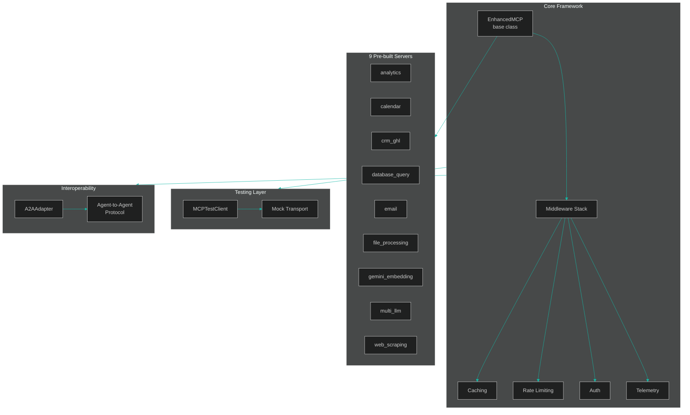

# MCP Server Toolkit


Production-ready framework for building [Model Context Protocol](https://modelcontextprotocol.io/) servers in Python. Ships with 9 pre-built servers, automatic caching, rate limiting, and OpenTelemetry integration -- so you can focus on your tool logic instead of infrastructure.

## Table of Contents

- [Why mcp-server-toolkit?](#why-mcp-server-toolkit)
- [Quick Start](#quick-start)
- [Installation](#installation)
- [Pre-built Servers](#pre-built-servers)
- [Framework Features](#framework-features)
- [A2A Protocol Support](#a2a-protocol-support)
- [Claude Desktop Configuration](#claude-desktop-configuration)
- [Examples](#examples)
- [Architecture](#architecture)
- [Certifications Applied](#certifications-applied)
- [Development](#development)
- [Contributing](#contributing)
- [License](#license)

## Why mcp-server-toolkit?

Building MCP servers from scratch means writing the same boilerplate every time. This toolkit adds the production layer on top of the raw MCP SDK.

| Feature | Raw MCP SDK | mcp-server-toolkit |
|---------|-------------|-------------------|
| Tool registration | Manual decorator wiring | Automatic via `EnhancedMCP` |
| Response caching | Not included | Built-in TTL cache |
| Rate limiting | Not included | Per-client limits |
| Auth middleware | Not included | API key / token auth |
| Telemetry / tracing | Not included | Span-based tracing |
| Test client | Manual mocking | `MCPTestClient` |
| Pre-built servers | Build your own | 9 ready-to-use servers |
| Agent-to-Agent (A2A) | Not included | A2AAdapter included |

## Quick Start

```python
from mcp_toolkit import EnhancedMCP

mcp = EnhancedMCP("my-server")

@mcp.tool()
async def greet(name: str) -> str:
    """Greet a user by name."""
    return f"Hello, {name}!"

@mcp.cached_tool(ttl=300)
async def expensive_query(query: str) -> str:
    """Results cached for 5 minutes automatically."""
    return await run_query(query)

@mcp.rate_limited_tool(max_calls=10, window_seconds=60)
async def limited_action(action: str) -> str:
    """Max 10 calls per minute per caller."""
    return await perform_action(action)
```

## Installation

```bash
pip install mcp-server-toolkit          # Core framework only
pip install mcp-server-toolkit[database] # + Database Query server (sqlglot, asyncpg)
pip install mcp-server-toolkit[web]      # + Web Scraping server (beautifulsoup4, lxml)
pip install mcp-server-toolkit[files]    # + File Processing server (PyPDF2, openpyxl)
pip install mcp-server-toolkit[redis]    # + Redis-backed caching
pip install mcp-server-toolkit[telemetry]# + OpenTelemetry tracing
pip install mcp-server-toolkit[all]      # Everything
```

## Pre-built Servers

Nine production-ready servers — import and run, no boilerplate required.

| Server | Description | Install Extra |
|--------|-------------|---------------|
| `database_query` | Natural language to SQL with sqlglot validation and schema introspection | `[database]` |
| `web_scraping` | Agent-driven web scraping with structured data extraction | `[web]` |
| `file_processing` | PDF/CSV/Excel/TXT parsing with RAG-optimized chunking | `[files]` |
| `analytics` | Metrics recording, aggregation, anomaly detection (z-score), chart generation | core |
| `email` | Email composition with template engine | core |
| `calendar` | Availability checking and scheduling | core |
| `crm_ghl` | GoHighLevel CRM — contact CRUD, pipeline summaries, opportunity tracking with field mapping | core |
| `gemini_embedding` | Gemini Embedding 2 — text embedding, semantic search, vector indexing, cosine similarity | core |
| `multi_llm` | Multi-provider LLM router — Gemini/OpenAI/xAI with cost routing, circuit breakers, and parallel second opinions | core |

<details>
<summary><strong>database_query</strong> — Natural language to SQL with sqlglot validation and schema introspection</summary>

```python
from mcp_toolkit.servers.database_query.server import mcp, configure

# Connect to your database
configure(db_connection=my_async_db, dialect="postgres")

# Tools available to agents:
# - query_database("How many users signed up last week?")
# - explain_query("Show me top customers by revenue")
# - list_tables()
```

</details>

<details>
<summary><strong>analytics</strong> — Metrics recording, aggregation, anomaly detection, chart generation</summary>

```python
from mcp_toolkit.servers.analytics.server import mcp, configure, MetricsStore

store = MetricsStore()
store.record("response_time", 145.2, timestamp="2024-01-15T10:00:00Z")
configure(store=store)

# Tools available:
# - query_metrics(metric="response_time", aggregation="avg")
# - detect_anomalies(metric="error_rate", z_threshold=2.0)
# - generate_chart(metric="response_time", chart_type="line")
```

</details>

<details>
<summary><strong>web_scraping</strong> — Agent-driven web scraping with structured data extraction</summary>

```python
from mcp_toolkit.servers.web_scraping.server import mcp

# Tools available:
# - scrape_page(url="https://example.com", extract="product prices")
# - extract_structured(url="...", schema={"name": "str", "price": "float"})
```

</details>

<details>
<summary><strong>crm_ghl</strong> — GoHighLevel CRM contact management, pipeline tracking, and opportunity creation</summary>

Contact management, pipeline tracking, and opportunity creation for GoHighLevel CRM. Includes a `GHLFieldMapper` for resolving natural language field names to GHL custom field IDs. Falls back to a `MockGHLClient` when no real client is configured, so agents can demo the tools without API credentials.

```python
from mcp_toolkit.servers.crm_ghl.server import mcp, configure

# Use the mock client for demos (default), or provide your own GHL API client
# configure(client=my_ghl_client)

# Tools available to agents:
# - search_contacts("John", limit=10)
# - create_contact(first_name="John", last_name="Doe", email="john@example.com")
# - get_pipeline_summary(pipeline_id="")
# - create_opportunity(contact_id="c1", name="Website Redesign", value=5000)
```

</details>

<details>
<summary><strong>gemini_embedding</strong> — Semantic search and vector indexing powered by Gemini Embedding 2</summary>

Semantic search and vector indexing powered by Gemini Embedding 2. Embeds text, indexes documents into an in-memory vector store, and performs cosine-similarity search. Uses a deterministic `MockEmbeddingClient` by default so agents can test without a Gemini API key.

```python
from mcp_toolkit.servers.gemini_embedding.server import mcp, configure

# Set GEMINI_API_KEY env var for real embeddings, or use the mock client (default)
# Tools available:
# - embed_text("hello world", task_type="SEMANTIC_SIMILARITY")
# - index_text(text="document content", item_id="doc1", metadata='{"source": "readme"}')
# - search(query="async patterns", top_k=5)
# - similarity(text_a="Python", text_b="JavaScript")
# - list_indexed()
# - clear_index()
```

</details>

<details>
<summary><strong>multi_llm</strong> — Multi-provider LLM router with cost routing, circuit breakers, and parallel second opinions</summary>

Route prompts across Gemini, OpenAI, and xAI/Grok based on cost or quality. Includes per-provider circuit breakers, parallel "second opinion" queries, and automatic fallback.

```python
from mcp_toolkit.servers.multi_llm.server import mcp, configure
from mcp_toolkit.servers.multi_llm.providers import GeminiProvider, OpenAICompatibleProvider
from mcp_toolkit.servers.multi_llm.models import ProviderName

configure(providers={
    ProviderName.GEMINI: GeminiProvider(api_key="...", default_model="gemini-3.1-pro-preview"),
    ProviderName.OPENAI: OpenAICompatibleProvider(
        api_key="...", base_url="https://api.openai.com/v1",
        provider=ProviderName.OPENAI, default_model="gpt-5.4",
    ),
})

# Tools available to agents:
# - query_model(provider="gemini", model="gemini-3.1-pro-preview", prompt="...")
# - query_cheap(prompt="...")          # routes to cheapest available model
# - query_best(prompt="...")           # routes to highest-quality available model
# - get_second_opinion(prompt="...")   # queries all providers in parallel
# - list_providers()                   # shows status and circuit breaker state
```

Set `GEMINI_API_KEY`, `OPENAI_API_KEY`, and/or `XAI_API_KEY` environment variables to enable each provider. Providers without a key are skipped; `query_cheap` and `query_best` fall through to the next available option automatically.

</details>

<details>
<summary><strong>email</strong> — Email composition with template engine</summary>

```python
from mcp_toolkit.servers.email.server import mcp

# Tools available to agents for email composition and templating
```

</details>

<details>
<summary><strong>calendar</strong> — Availability checking and scheduling</summary>

```python
from mcp_toolkit.servers.calendar.server import mcp

# Tools available to agents for availability checking and scheduling
```

</details>

<details>
<summary><strong>file_processing</strong> — PDF/CSV/Excel/TXT parsing with RAG-optimized chunking</summary>

```python
from mcp_toolkit.servers.file_processing.server import mcp

# Tools available:
# - parse_file(path="report.pdf")
# - chunk_for_rag(text="...", chunk_size=512)
```

</details>

## Framework Features

### Caching

Built-in L1 (in-memory) cache with optional Redis backend:

```python
from mcp_toolkit.framework.caching import CacheLayer, RedisCache

# Redis-backed caching
cache = CacheLayer(backend=RedisCache(url="redis://localhost:6379"))
```

### Rate Limiting

Per-caller rate limiting with configurable windows:

```python
@mcp.rate_limited_tool(max_calls=100, window_seconds=60)
async def my_tool(query: str) -> str:
    ...
```

### Authentication

API key and OAuth support:

```python
from mcp_toolkit.framework.auth import APIKeyAuth, OAuthAuth

auth = APIKeyAuth()
auth.register_key("my-api-key", client_id="my-client", scopes=["read", "write"])
```

### Telemetry

OpenTelemetry integration for tracing and metrics:

```python
from mcp_toolkit.framework.telemetry import TelemetryProvider

telemetry = TelemetryProvider("my-server")
telemetry.initialize()
```

### Testing

First-class test client for unit testing your MCP servers:

```python
from mcp_toolkit import MCPTestClient

client = MCPTestClient(mcp)
result = await client.call_tool("greet", {"name": "World"})
assert result == "Hello, World!"
```

## A2A Protocol Support

Every MCP server in this toolkit can be exposed as a [Google Agent-to-Agent (A2A)](https://google.github.io/A2A/) compatible agent. The `A2AAdapter` bridges MCP tool invocations to the A2A task protocol, enabling interoperability with multi-vendor agent ecosystems.

```python
from mcp_toolkit import EnhancedMCP
from mcp_toolkit.framework.a2a_adapter import A2AAdapter

mcp = EnhancedMCP("my-server")

@mcp.tool()
async def answer(question: str) -> str:
    return f"Answer to: {question}"

adapter = A2AAdapter(mcp, base_url="https://my-server.example.com")

# Serve /.well-known/agent.json for A2A discovery
agent_card = await adapter.get_agent_card()

# Handle an incoming A2A task — routes to the matching MCP tool
status = await adapter.handle_task("task-123", "answer", {"question": "What is 2+2?"})
print(status.status)   # "completed"
print(status.message)  # "Answer to: What is 2+2?"

# Track task state
status = adapter.get_task_status("task-123")
```

The agent card is auto-generated from your MCP tool metadata, so it stays in sync as you add tools.

### Claude Desktop Configuration

Add servers to `~/.claude/claude_desktop_config.json`:

```json
{
  "mcpServers": {
    "analytics": {
      "command": "python3",
      "args": ["-m", "mcp_toolkit.servers.analytics.server"]
    },
    "crm-ghl": {
      "command": "python3",
      "args": ["-m", "mcp_toolkit.servers.crm_ghl.server"]
    },
    "gemini-embedding": {
      "command": "python3",
      "args": ["-m", "mcp_toolkit.servers.gemini_embedding.server"],
      "env": {
        "GEMINI_API_KEY": "your-api-key"
      }
    }
  }
}
```

## Examples

See the [`examples/`](examples/) directory for working implementations:

- [`basic_server.py`](examples/basic_server.py) — minimal server with 2 tools
- [`cached_tools.py`](examples/cached_tools.py) — caching with `@mcp.cached_tool()` decorator
- [`database_query_usage.py`](examples/database_query_usage.py) — pre-built SQL database server
- [`crm_ghl_usage.py`](examples/crm_ghl_usage.py) — GoHighLevel CRM contact and pipeline management
- [`gemini_embedding_usage.py`](examples/gemini_embedding_usage.py) — text embedding, vector indexing, and semantic search

## Architecture



## Certifications Applied

Domain pillars from [19 completed AI/ML certifications](https://caymanroden.com) backing this toolkit:

| Domain | Certification | Applied In |
|--------|--------------|-----------|
| LLM APIs & Tool Use | Anthropic Building with Claude (Vanderbilt) | `EnhancedMCP` tool registration pattern, A2AAdapter protocol |
| MLOps & Production Systems | IBM DevOps and Software Engineering | CI/CD pipeline, coverage floors, `--cov-fail-under` |
| Distributed Systems | IBM Full Stack Developer | Rate limiting middleware, caching TTL strategy |
| AI Agent Architecture | Microsoft AI for Beginners | Agent-to-agent protocol design, MCPTestClient |
| Python Engineering | Meta Back-End Developer (Python) | hatch packaging, ruff lint, `pyproject.toml` structure |

## Development

```bash
git clone https://github.com/ChunkyTortoise/mcp-server-toolkit.git
cd mcp-server-toolkit
pip install -e ".[dev]"
pytest tests/ -v
ruff check .
```

## Contributing

See [CONTRIBUTING.md](CONTRIBUTING.md) for setup instructions, test commands, how to add a new server, and the PR process.

## License

MIT
