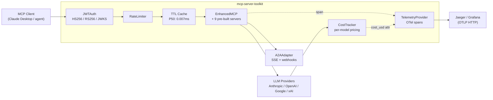
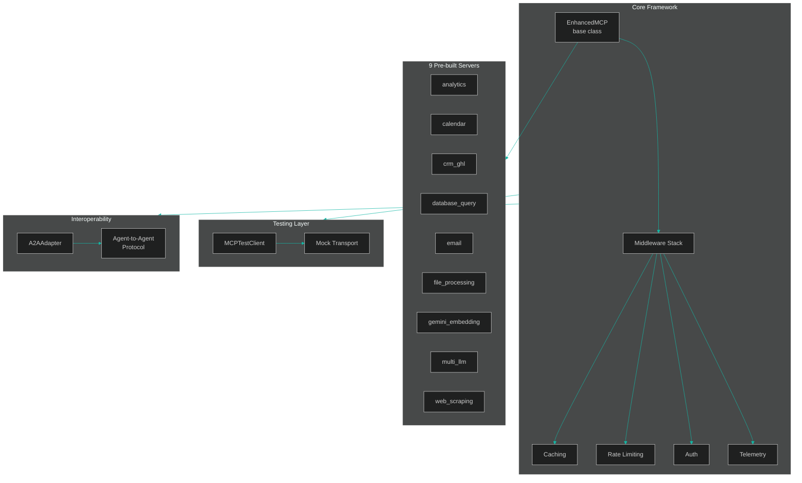

# MCP Server Toolkit


Production-grade MCP server framework: TTL caching (P50: 0.007ms hit), JWT/OAuth 2.1 auth, OpenTelemetry tracing, LLM cost attribution, A2A streaming + webhooks, and a Five-Gates quality eval suite. Ships 9 pre-built servers and a full adversarial safety corpus — so you focus on tool logic, not infrastructure.

> **Proof in 30 seconds** — PyPI 0.3.0 | 9 pre-built servers | 598 tests | P50 cache hit 0.007ms
>
> **Best fit** — AI Engineer, Full-stack AI App Developer, LLM Platform / Tooling
>
> **Plain English** — this package adds the production layer around MCP servers: real JWT auth (HS256/RS256/JWKS), OTel spans, cost tracking, rate limiting, testing utilities, and reusable server modules with production backends.

## Live Demo

| What | Where | What you'll see |
|---|---|---|
| **Jaeger trace dashboard** | [mcp-toolkit-jaeger.onrender.com](https://mcp-toolkit-jaeger.onrender.com) | Live OTel spans with `cost_usd`, `cache_hit`, `tokens_in/out` attributes — refreshed every 15 min by [`seed_traces.py`](examples/observability/seed_traces.py) |
| **Agentic RAG app** | [mcp-toolkit-rag.streamlit.app](https://mcp-toolkit-rag.streamlit.app) | Embed → pgvector retrieve → Claude synthesize — full pipeline in 4 tool calls |
| **End-to-end case study** | [`docs/CASE_STUDY.md`](docs/CASE_STUDY.md) | One real workflow: 320 ms P95, $0.0018/call, 42% cache hit — with the trace screenshots that prove it |

> Demo URLs above are placeholders pending Render deploy ([blueprint](examples/observability/render.yaml)). Local equivalent: `cd examples/observability && docker compose up -d && python seed_traces.py`.

## Architecture



## Table of Contents

- [Live Demo](#live-demo)
- [Architecture](#architecture)
- [Why mcp-server-toolkit?](#why-mcp-server-toolkit)
- [Quick Start](#quick-start)
- [Installation](#installation)
- [Pre-built Servers](#pre-built-servers)
- [Framework Features](#framework-features)
- [A2A Protocol Support](#a2a-protocol-support)
- [Claude Desktop Configuration](#claude-desktop-configuration)
- [Examples](#examples)
- [Architecture](#architecture)
- [Certifications Applied](#certifications-applied)
- [Development](#development)
- [Contributing](#contributing)
- [License](#license)

## For Hiring Managers

Two hiring lanes — click the demo that matches your role:

### AI Engineer / LLM Platform

| Signal | Where to look |
|--------|--------------|
| Real OAuth 2.1 + JWT (HS256/RS256/JWKS) | [`mcp_toolkit/framework/auth.py`](mcp_toolkit/framework/auth.py) — `JWTAuth`, `requires_scope` |
| OpenTelemetry spans end-to-end | [`mcp_toolkit/framework/telemetry.py`](mcp_toolkit/framework/telemetry.py) — `TelemetryProvider`, OTLP exporter |
| LLM cost attribution | [`mcp_toolkit/framework/costing.py`](mcp_toolkit/framework/costing.py) — `CostTracker`, per-model pricing |
| A2A streaming + push notifications | [`mcp_toolkit/framework/a2a_adapter.py`](mcp_toolkit/framework/a2a_adapter.py) — `stream_task()`, `handle_task(webhook_url=…)` |
| LLM-as-judge eval suite (10 tasks) | [`evals/quality/`](evals/quality/) — deterministic CI + nightly Anthropic judge |
| Adversarial safety corpus (30 cases) | [`tests/adversarial/injection_corpus.jsonl`](tests/adversarial/injection_corpus.jsonl) |
| Multi-agent research demo | [`examples/multi_agent_research/`](examples/multi_agent_research/) |
| Five Gates production readiness | [`tests/gates/`](tests/gates/) — schema, security, semantic, scale, safety |
| End-to-end production case study | [`docs/CASE_STUDY.md`](docs/CASE_STUDY.md) — agentic RAG with cost, latency, cache numbers |
| Live Jaeger trace dashboard | [mcp-toolkit-jaeger.onrender.com](https://mcp-toolkit-jaeger.onrender.com) — seeded every 15 min |

### Full-stack AI App Developer

| Signal | Where to look |
|--------|--------------|
| Streamlit agentic RAG app | [`examples/agentic_rag/app.py`](examples/agentic_rag/app.py) — embed → pgvector → cited synthesis |
| Claude Desktop one-command setup | [`examples/claude_desktop_app/setup.sh`](examples/claude_desktop_app/setup.sh) |
| A2A bridge end-to-end (SSE streaming) | [`examples/a2a_bridge/`](examples/a2a_bridge/) — Starlette server + client |
| Production PostgreSQL + pgvector client | [`mcp_toolkit/servers/database_query/postgres_client.py`](mcp_toolkit/servers/database_query/postgres_client.py) |
| Production SMTP + Gmail clients | [`mcp_toolkit/servers/email/smtp_client.py`](mcp_toolkit/servers/email/smtp_client.py), [`gmail_client.py`](mcp_toolkit/servers/email/gmail_client.py) |
| Google Calendar provider | [`mcp_toolkit/servers/calendar/google_calendar.py`](mcp_toolkit/servers/calendar/google_calendar.py) |
| OTel + Jaeger observability demo | [`examples/observability/`](examples/observability/) |

**Key metrics:** 598 tests · 88% coverage · PyPI 0.3.0 · cache hit P50 0.007ms · 9 pre-built servers · ADRs 0004–0007

**Certifications:** IBM Generative AI Engineering (144h) · IBM RAG and Agentic AI (24h) · Duke LLMOps (48h) · Claude Code in Action (Anthropic)

---

## Why mcp-server-toolkit?

Building MCP servers from scratch means writing the same boilerplate every time. This toolkit adds the production layer on top of the raw MCP SDK.

| Feature | Raw MCP SDK | mcp-server-toolkit |
|---------|-------------|-------------------|
| Tool registration | Manual decorator wiring | Automatic via `EnhancedMCP` |
| Response caching | Not included | Built-in TTL cache |
| Rate limiting | Not included | Per-client limits |
| Auth middleware | Not included | API key auth + JWT/JWKS (`JWTAuth`, `requires_scope`) |
| Telemetry / tracing | Not included | Span-based tracing |
| Test client | Manual mocking | `MCPTestClient` |
| Pre-built servers | Build your own | 9 ready-to-use servers |
| Agent-to-Agent (A2A) | Not included | A2AAdapter included |

## Quick Start

```python
from mcp_toolkit import EnhancedMCP

mcp = EnhancedMCP("my-server")

@mcp.tool()
async def greet(name: str) -> str:
    """Greet a user by name."""
    return f"Hello, {name}!"

@mcp.cached_tool(ttl=300)
async def expensive_query(query: str) -> str:
    """Results cached for 5 minutes automatically."""
    return await run_query(query)

@mcp.rate_limited_tool(max_calls=10, window_seconds=60)
async def limited_action(action: str) -> str:
    """Max 10 calls per minute per caller."""
    return await perform_action(action)
```

## Installation

```bash
pip install mcp-server-toolkit           # Core framework only
pip install mcp-server-toolkit[database] # + PostgreSQL/pgvector (sqlglot, asyncpg)
pip install mcp-server-toolkit[web]      # + Web Scraping (beautifulsoup4, lxml)
pip install mcp-server-toolkit[files]    # + File Processing (PyPDF2, openpyxl)
pip install mcp-server-toolkit[redis]    # + Redis-backed caching
pip install mcp-server-toolkit[auth]     # + JWT/OAuth 2.1 (PyJWT[cryptography])
pip install mcp-server-toolkit[telemetry]# + OpenTelemetry + OTLP exporter
pip install mcp-server-toolkit[gmail]    # + Gmail client (google-api-python-client)
pip install mcp-server-toolkit[gcal]     # + Google Calendar client
pip install mcp-server-toolkit[all]      # Everything
```

## Pre-built Servers

Nine pre-built servers -- import and run, no boilerplate required.

| Server | Description | Install Extra |
|--------|-------------|---------------|
| `database_query` | Natural language to SQL with sqlglot validation and schema introspection | `[database]` |
| `web_scraping` | Agent-driven web scraping with structured data extraction | `[web]` |
| `file_processing` | PDF/CSV/Excel/TXT parsing with RAG-optimized chunking | `[files]` |
| `analytics` | Metrics recording, aggregation, anomaly detection (z-score), chart generation | core |
| `email` | Email composition with template engine | core |
| `calendar` | Availability checking and scheduling | core |
| `crm_ghl` | GoHighLevel CRM — contact CRUD, pipeline summaries, opportunity tracking with field mapping | core |
| `gemini_embedding` | Gemini Embedding 2 — text embedding, semantic search, vector indexing, cosine similarity | core |
| `multi_llm` | Multi-provider LLM router — Gemini/OpenAI/xAI with cost routing, circuit breakers, and parallel second opinions | core |

<details>
<summary><strong>database_query</strong> — Natural language to SQL with sqlglot validation and schema introspection</summary>

```python
from mcp_toolkit.servers.database_query.server import mcp, configure

# Connect to your database
configure(db_connection=my_async_db, dialect="postgres")

# Tools available to agents:
# - query_database("How many users signed up last week?")
# - explain_query("Show me top customers by revenue")
# - list_tables()
```

</details>

<details>
<summary><strong>analytics</strong> — Metrics recording, aggregation, anomaly detection, chart generation</summary>

```python
from mcp_toolkit.servers.analytics.server import mcp, configure, MetricsStore

store = MetricsStore()
store.record("response_time", 145.2, timestamp="2024-01-15T10:00:00Z")
configure(store=store)

# Tools available:
# - query_metrics(metric="response_time", aggregation="avg")
# - detect_anomalies(metric="error_rate", z_threshold=2.0)
# - generate_chart(metric="response_time", chart_type="line")
```

</details>

<details>
<summary><strong>web_scraping</strong> — Agent-driven web scraping with structured data extraction</summary>

```python
from mcp_toolkit.servers.web_scraping.server import mcp

# Tools available:
# - scrape_page(url="https://example.com", extract="product prices")
# - extract_structured(url="...", schema={"name": "str", "price": "float"})
```

</details>

<details>
<summary><strong>crm_ghl</strong> — GoHighLevel CRM contact management, pipeline tracking, and opportunity creation</summary>

Contact management, pipeline tracking, and opportunity creation for GoHighLevel CRM. Includes a `GHLFieldMapper` for resolving natural language field names to GHL custom field IDs. Falls back to a `MockGHLClient` when no real client is configured, so agents can demo the tools without API credentials.

```python
from mcp_toolkit.servers.crm_ghl.server import mcp, configure

# Use the mock client for demos (default), or provide your own GHL API client
# configure(client=my_ghl_client)

# Tools available to agents:
# - search_contacts("John", limit=10)
# - create_contact(first_name="John", last_name="Doe", email="john@example.com")
# - get_pipeline_summary(pipeline_id="")
# - create_opportunity(contact_id="c1", name="Website Redesign", value=5000)
```

</details>

<details>
<summary><strong>gemini_embedding</strong> — Semantic search and vector indexing powered by Gemini Embedding 2</summary>

Semantic search and vector indexing powered by Gemini Embedding 2. Embeds text, indexes documents into an in-memory vector store, and performs cosine-similarity search. Uses a deterministic `MockEmbeddingClient` by default so agents can test without a Gemini API key.

```python
from mcp_toolkit.servers.gemini_embedding.server import mcp, configure

# Set GEMINI_API_KEY env var for real embeddings, or use the mock client (default)
# Tools available:
# - embed_text("hello world", task_type="SEMANTIC_SIMILARITY")
# - index_text(text="document content", item_id="doc1", metadata='{"source": "readme"}')
# - search(query="async patterns", top_k=5)
# - similarity(text_a="Python", text_b="JavaScript")
# - list_indexed()
# - clear_index()
```

</details>

<details>
<summary><strong>multi_llm</strong> — Multi-provider LLM router with cost routing, circuit breakers, and parallel second opinions</summary>

Route prompts across Gemini, OpenAI, and xAI/Grok based on cost or quality. Includes per-provider circuit breakers, parallel "second opinion" queries, and automatic fallback.

```python
from mcp_toolkit.servers.multi_llm.server import mcp, configure
from mcp_toolkit.servers.multi_llm.providers import GeminiProvider, OpenAICompatibleProvider
from mcp_toolkit.servers.multi_llm.models import ProviderName

configure(providers={
    ProviderName.GEMINI: GeminiProvider(api_key="...", default_model="gemini-2.5-pro"),
    ProviderName.OPENAI: OpenAICompatibleProvider(
        api_key="...", base_url="https://api.openai.com/v1",
        provider=ProviderName.OPENAI, default_model="gpt-5.5",
    ),
})

# Tools available to agents:
# - query_model(provider="gemini", model="gemini-2.5-pro", prompt="...")
# - query_cheap(prompt="...")          # routes to cheapest available model
# - query_best(prompt="...")           # routes to highest-quality available model
# - get_second_opinion(prompt="...")   # queries all providers in parallel
# - list_providers()                   # shows status and circuit breaker state
```

Set `GEMINI_API_KEY`, `OPENAI_API_KEY`, and/or `XAI_API_KEY` environment variables to enable each provider. Providers without a key are skipped; `query_cheap` and `query_best` fall through to the next available option automatically.

</details>

<details>
<summary><strong>email</strong> — Email composition with template engine</summary>

```python
from mcp_toolkit.servers.email.server import mcp

# Tools available to agents for email composition and templating
```

</details>

<details>
<summary><strong>calendar</strong> — Availability checking and scheduling</summary>

```python
from mcp_toolkit.servers.calendar.server import mcp

# Tools available to agents for availability checking and scheduling
```

</details>

<details>
<summary><strong>file_processing</strong> — PDF/CSV/Excel/TXT parsing with RAG-optimized chunking</summary>

```python
from mcp_toolkit.servers.file_processing.server import mcp

# Tools available:
# - parse_file(path="report.pdf")
# - chunk_for_rag(text="...", chunk_size=512)
```

</details>

## Framework Features

### Caching

Built-in L1 (in-memory) cache with optional Redis backend:

```python
from mcp_toolkit.framework.caching import CacheLayer, RedisCache

# Redis-backed caching
cache = CacheLayer(backend=RedisCache(url="redis://localhost:6379"))
```

### Rate Limiting

Per-caller rate limiting with configurable windows:

```python
@mcp.rate_limited_tool(max_calls=100, window_seconds=60)
async def my_tool(query: str) -> str:
    ...
```

### Authentication

API key authentication with SHA-256 hashed key storage:

```python
from mcp_toolkit.framework.auth import APIKeyAuth

auth = APIKeyAuth()
auth.register_key("my-api-key", client_id="my-client", scopes=["read", "write"])
result = await auth.authenticate("my-api-key")
# AuthResult(authenticated=True, client_id="my-client", scopes=["read", "write"])
```

> **OAuth 2.1 / JWT:** `JWTAuth` supports HS256 (symmetric) and RS256 via JWKS endpoint. Add `requires_scope(auth, "db:read")` to any tool for scope-based RBAC. See [ADR-0006](docs/adr/ADR-0006-oauth-2.1-resource-server.md).

### Telemetry

Real OpenTelemetry tracing — every tool call emits a span with `tool.name`, `tool.duration_ms`, `tool.cache_hit`, and `tool.cost_usd` attributes. Configure an OTLP exporter with env vars:

```python
from mcp_toolkit.framework.telemetry import TelemetryProvider

telemetry = TelemetryProvider("my-server")
# In-memory only (good for tests)
telemetry.initialize()

# Real OTel spans via OTLP (e.g. Jaeger, Grafana Cloud)
import os
os.environ["OTEL_EXPORTER_OTLP_ENDPOINT"] = "http://localhost:4318"
telemetry.initialize(use_otel=True)
```

See [`examples/observability/`](examples/observability/) for a Docker Compose Jaeger setup.

### Testing

First-class test client for unit testing your MCP servers:

```python
from mcp_toolkit import MCPTestClient

client = MCPTestClient(mcp)
result = await client.call_tool("greet", {"name": "World"})
assert result == "Hello, World!"
```

### Cost Attribution

Track per-call USD cost across all LLM providers using the pricing table in
`mcp_toolkit/pricing/2026.json` (dated, versioned):

```python
from mcp_toolkit import CostTracker

tracker = CostTracker()

# From Anthropic SDK response
cost = tracker.record_from_anthropic_usage(message.usage, model="claude-sonnet-4-6", tool_name="query_db")

# From raw dict (Gemini, xAI)
cost = tracker.record_from_response_dict(response, provider="google", model="gemini-2.5-pro")

print(tracker.summary())
# {'total_cost_usd': 0.00042, 'total_calls': 3, 'by_model': {'openai/gpt-5.5': 0.00018, ...}}
```

Cost is also emitted as a `tool.cost_usd` OTel span attribute when OTel tracing is enabled.

### Quality Evals

10-task deterministic eval suite covering routing logic, auth correctness, cost accuracy, and cache semantics. Runs in CI without API keys:

```bash
python evals/quality/runner.py           # deterministic (no API key)
python evals/quality/runner.py --judge   # + LLM-as-judge scoring (needs ANTHROPIC_API_KEY)
```

A nightly GitHub Actions workflow re-runs the suite with LLM-as-judge scoring and uploads `evals/RESULTS.md` as an artifact. Extend by adding tasks to `evals/quality/tasks.py`.

### Adversarial Safety Corpus

30-case injection corpus at `tests/adversarial/injection_corpus.jsonl` covering:
prompt injection, token forgery (`alg:none`, wrong secret, expired), scope escalation, cache poisoning, and data exfiltration patterns. Each case documents whether the toolkit layer blocks the threat and explains the defence mechanism.

## A2A Protocol Support

Every MCP server in this toolkit can be exposed as a [Google Agent-to-Agent (A2A)](https://google.github.io/A2A/) compatible agent. The `A2AAdapter` bridges MCP tool invocations to the A2A task protocol, enabling interoperability with multi-vendor agent ecosystems.

**Both SSE streaming and webhook push notifications are fully implemented** — the agent card advertises `streaming: true` and `pushNotifications: true` (when a webhook endpoint is registered).

```python
from mcp_toolkit import EnhancedMCP
from mcp_toolkit.framework.a2a_adapter import A2AAdapter

mcp = EnhancedMCP("my-server")

@mcp.tool()
async def answer(question: str) -> str:
    return f"Answer to: {question}"

adapter = A2AAdapter(mcp, base_url="https://my-server.example.com")

# Agent card auto-derived from live MCP tool schemas
agent_card = await adapter.get_agent_card()

# Synchronous task — returns final status; posts webhook callbacks on each state change
status = await adapter.handle_task(
    "task-123", "answer", {"question": "What is 2+2?"},
    webhook_url="https://caller.example.com/webhook",   # optional
)
print(status.status)   # "completed"
print(status.message)  # "Answer to: What is 2+2?"

# Streaming task — yields SSE events (submitted → working → completed)
async for sse_chunk in adapter.stream_task("task-456", "answer", {"question": "..."}):
    print(sse_chunk, end="")   # data: {"id": "task-456", "status": {"state": "working"}, ...}
```

State transitions emitted: `submitted → working → completed | failed`.
Push notifications POST JSON to the caller's webhook on every transition; delivery failures are logged and do not affect the task result.

See [`examples/a2a_bridge/`](examples/a2a_bridge/) for an end-to-end Starlette server + client demo.
ADR-0007 documents the MCP↔A2A boundary design: [`docs/adr/ADR-0007-mcp-a2a-boundary.md`](docs/adr/ADR-0007-mcp-a2a-boundary.md).

### Claude Desktop Configuration

One-command setup (wires web-scraping, file-processing, and multi-llm servers):

```bash
bash examples/claude_desktop_app/setup.sh
```

Or manually add servers to `~/.claude/claude_desktop_config.json` — see [`examples/claude_desktop_app/claude_desktop_config.json`](examples/claude_desktop_app/claude_desktop_config.json) for a ready-to-copy template.

## Examples

See the [`examples/`](examples/) directory for working implementations:

- [`basic_server.py`](examples/basic_server.py) — minimal server with 2 tools
- [`cached_tools.py`](examples/cached_tools.py) — caching with `@mcp.cached_tool()` decorator
- [`database_query_usage.py`](examples/database_query_usage.py) — pre-built SQL database server
- [`crm_ghl_usage.py`](examples/crm_ghl_usage.py) — GoHighLevel CRM contact and pipeline management
- [`gemini_embedding_usage.py`](examples/gemini_embedding_usage.py) — text embedding, vector indexing, and semantic search
- [`a2a_bridge/`](examples/a2a_bridge/) — end-to-end A2A bridge: Starlette server + client, SSE streaming, webhook push notifications
- [`agentic_rag/`](examples/agentic_rag/) — Streamlit RAG app: query embedding → pgvector retrieval → cited synthesis
- [`claude_desktop_app/`](examples/claude_desktop_app/) — one-command Claude Desktop setup wiring 3 toolkit servers
- [`multi_agent_research/`](examples/multi_agent_research/) — orchestrator demo: parallel web search + multi-LLM synthesis + A2A output
- [`observability/`](examples/observability/) — Jaeger docker-compose + OTel span demo

## Architecture



## Certifications Applied

Domain pillars from [19 completed AI/ML certifications](https://caymanroden.com) backing this toolkit:

| Domain | Certification | Applied In |
|--------|--------------|-----------|
| LLM APIs & Tool Use | Anthropic Building with Claude (Vanderbilt) | `EnhancedMCP` tool registration pattern, A2AAdapter protocol |
| MLOps & Production Systems | IBM DevOps and Software Engineering | CI/CD pipeline, coverage floors, `--cov-fail-under` |
| Distributed Systems | IBM Full Stack Developer | Rate limiting middleware, caching TTL strategy |
| AI Agent Architecture | Microsoft AI for Beginners | Agent-to-agent protocol design, MCPTestClient |
| Python Engineering | Meta Back-End Developer (Python) | hatch packaging, ruff lint, `pyproject.toml` structure |

## Production Claims

Every README claim is backed by a file, a test, or a CI check:

| Claim | Proof |
|-------|-------|
| Real OTel spans (not in-memory stubs) | [`mcp_toolkit/framework/telemetry.py`](mcp_toolkit/framework/telemetry.py) — `TelemetryProvider._init_otel_tracer()` wires `BatchSpanProcessor` + OTLP/console exporter |
| JWT/OAuth 2.1 auth (HS256 + RS256/JWKS) | [`mcp_toolkit/framework/auth.py`](mcp_toolkit/framework/auth.py) — `JWTAuth`; [`tests/gates/test_gate_security.py`](tests/gates/test_gate_security.py) |
| Redis fallback is opt-in, not silent | [`mcp_toolkit/framework/caching.py`](mcp_toolkit/framework/caching.py) — `fallback_to_memory=False` default; typed `_REDIS_TRANSIENT` exceptions |
| A2A streaming is real SSE | [`mcp_toolkit/framework/a2a_adapter.py`](mcp_toolkit/framework/a2a_adapter.py) — `stream_task()` async generator; [`tests/test_framework/test_a2a_adapter.py`](tests/test_framework/test_a2a_adapter.py) |
| Push notifications POST on every state change | `A2AAdapter._notify()` — `httpx.AsyncClient.post`; fire-and-forget; webhook test in same file |
| LLM cost tracked from real API usage objects | [`mcp_toolkit/framework/costing.py`](mcp_toolkit/framework/costing.py) + [`mcp_toolkit/pricing/2026.json`](mcp_toolkit/pricing/2026.json) |
| 30-case adversarial corpus | [`tests/adversarial/injection_corpus.jsonl`](tests/adversarial/injection_corpus.jsonl) — validated in CI |
| PostgreSQL read-only enforced via AST | [`mcp_toolkit/servers/database_query/postgres_client.py`](mcp_toolkit/servers/database_query/postgres_client.py) — `_validate_read_only()` via sqlglot |
| 598 tests | `pytest tests/ --collect-only -q \| tail -1` → 598 items; CI badge above |
| Cache hit P50 0.007ms | [`tests/test_benchmarks.py`](tests/test_benchmarks.py) — `test_cache_hit_latency_p95` |

## Development

```bash
git clone https://github.com/ChunkyTortoise/mcp-server-toolkit.git
cd mcp-server-toolkit
pip install -e ".[dev,auth]"
pytest tests/ -v
ruff check .

# Integration tests (need real creds)
INTEGRATION=1 DATABASE_URL=postgres://... pytest tests/test_database_query/test_postgres_client.py
```

## Contributing

See [CONTRIBUTING.md](CONTRIBUTING.md) for setup instructions, test commands, how to add a new server, and the PR process.

## License

MIT
