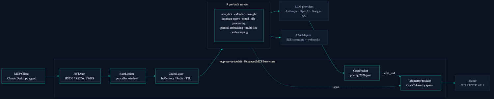

# MCP Server Toolkit

Building an MCP server means re-writing the same auth, caching, rate-limiting, and telemetry boilerplate every time; this packages that layer plus 9 ready-to-run servers so you write tool logic instead of infrastructure.

**Install from source** (recommended). PyPI still publishes `0.1.0`; this repo is `0.3.0`. Use the editable install below until a release play republishes.




## Measured results

Every number below is from a reproducible local run on this commit. No hosted dependency, no API keys.

| Metric | Value | Method |
|---|---|---|
| Cache hit latency | P50 0.008 ms, P95 0.009 ms | `python benchmarks/bench_cache.py` (500 iters, 20 warmup) |
| Cache miss latency | P50 0.022 ms | same run |
| Cache speedup | 2.9x vs. miss | same run, median miss / median hit |
| Test suite | 600 tests | `pytest tests/ --collect-only -q` |
| Test coverage | 82.87% measured | `pytest --cov`; CI gate `--cov-fail-under=80` in `.github/workflows/ci.yml` |
| Pre-built servers | 9 | `mcp_toolkit/servers/*/server.py` |
| Adversarial corpus | 30 cases | `tests/adversarial/injection_corpus.jsonl` |
| Python support | 3.10 / 3.11 / 3.12 | CI matrix in `.github/workflows/ci.yml` |

## Quickstart

```bash
git clone https://github.com/ChunkyTortoise/mcp-server-toolkit.git
cd mcp-server-toolkit
pip install -e ".[dev]"
```

```python
from mcp_toolkit import EnhancedMCP

mcp = EnhancedMCP("my-server")

@mcp.tool()
async def greet(name: str) -> str:
    return f"Hello, {name}!"

@mcp.cached_tool(ttl=300)
async def expensive_query(query: str) -> str:
    return await run_query(query)          # cached 5 min per arg-set

@mcp.rate_limited_tool(max_calls=10, window_seconds=60)
async def limited_action(action: str) -> str:
    return await perform_action(action)
```

Run it as any MCP server, or wire it into Claude Desktop with `bash examples/claude_desktop_app/setup.sh`.

## Demo (local, no hosted dependency)

| What | How | What you see |
|---|---|---|
| OTel + Jaeger traces | `cd examples/observability && docker compose up -d && python seed_traces.py` | Spans carrying `cost_usd`, `cache_hit`, `tokens_in/out` ([`seed_traces.py`](examples/observability/seed_traces.py)). A Render blueprint is committed but not yet deployed ([`render.yaml`](examples/observability/render.yaml)). |
| Agentic RAG app | [`examples/agentic_rag/app.py`](examples/agentic_rag/app.py) | Embed, pgvector retrieve, Claude synthesize in 4 tool calls |
| Worked case study | [`docs/CASE_STUDY.md`](docs/CASE_STUDY.md) | One workflow with seeded latency/cost numbers and trace screenshots (numbers labeled seeded in the doc) |

## What you get vs. the raw MCP SDK

| Capability | Raw MCP SDK | mcp-server-toolkit |
|---|---|---|
| Tool registration | Manual decorator wiring | Automatic via `EnhancedMCP` |
| Response caching | Not included | TTL cache, in-memory or Redis |
| Rate limiting | Not included | Per-caller windows |
| Auth | Not included | API key + JWT (HS256 / RS256 / JWKS), scope RBAC |
| Telemetry | Not included | OpenTelemetry spans, OTLP export |
| Cost attribution | Not included | Per-call `cost_usd` from a dated pricing table |
| Test client | Manual mocking | `MCPTestClient` |
| Pre-built servers | Build your own | 9 ready servers |
| Agent-to-Agent | Not included | `A2AAdapter`, SSE + webhooks |

## Installation

Source install (matches this repo version):

```bash
git clone https://github.com/ChunkyTortoise/mcp-server-toolkit.git
cd mcp-server-toolkit
pip install -e "."                 # core framework
pip install -e ".[database]"       # + PostgreSQL/pgvector (sqlglot, asyncpg)
pip install -e ".[web]"            # + web scraping (beautifulsoup4, lxml)
pip install -e ".[files]"          # + file processing (PyPDF2, openpyxl)
pip install -e ".[redis]"          # + Redis-backed caching
pip install -e ".[auth]"           # + JWT/OAuth 2.1 (PyJWT[cryptography])
pip install -e ".[telemetry]"      # + OpenTelemetry + OTLP exporter
pip install -e ".[gmail]"          # + Gmail client
pip install -e ".[gcal]"           # + Google Calendar client
pip install -e ".[all]"            # everything
pip install -e ".[dev]"            # tests + lint tooling
```

PyPI package `mcp-server-toolkit==0.1.0` is stale relative to this tree (`0.3.0`). Do not treat `pip install mcp-server-toolkit` as the supported path until an owner-gated publish play ships a matching release.

## Pre-built servers

Nine servers, import and run, no boilerplate.

| Server | Description | Install extra |
|--------|-------------|---------------|
| `database_query` | Natural language to SQL with sqlglot validation and schema introspection | `[database]` |
| `web_scraping` | Agent-driven web scraping with structured data extraction | `[web]` |
| `file_processing` | PDF/CSV/Excel/TXT parsing with RAG-optimized chunking | `[files]` |
| `analytics` | Metrics recording, aggregation, anomaly detection (z-score), chart generation | core |
| `email` | Email composition with template engine | core |
| `calendar` | Availability checking and scheduling | core |
| `crm_ghl` | GoHighLevel CRM: contact CRUD, pipeline summaries, opportunity tracking with field mapping | core |
| `gemini_embedding` | Gemini Embedding 2: text embedding, semantic search, vector indexing, cosine similarity | core |
| `multi_llm` | Multi-provider LLM router: Gemini/OpenAI/xAI with cost routing, circuit breakers, parallel second opinions | core |

<details>
<summary><strong>database_query</strong>: Natural language to SQL with sqlglot validation and schema introspection</summary>

```python
from mcp_toolkit.servers.database_query.server import mcp, configure

# Connect to your database
configure(db_connection=my_async_db, dialect="postgres")

# Tools available to agents:
# - query_database("How many users signed up last week?")
# - explain_query("Show me top customers by revenue")
# - list_tables()
```

</details>

<details>
<summary><strong>analytics</strong>: Metrics recording, aggregation, anomaly detection, chart generation</summary>

```python
from mcp_toolkit.servers.analytics.server import mcp, configure, MetricsStore

store = MetricsStore()
store.record("response_time", 145.2, timestamp="2024-01-15T10:00:00Z")
configure(store=store)

# Tools available:
# - query_metrics(metric="response_time", aggregation="avg")
# - detect_anomalies(metric="error_rate", z_threshold=2.0)
# - generate_chart(metric="response_time", chart_type="line")
```

</details>

<details>
<summary><strong>web_scraping</strong>: Agent-driven web scraping with structured data extraction</summary>

```python
from mcp_toolkit.servers.web_scraping.server import mcp

# Tools available:
# - scrape_page(url="https://example.com", extract="product prices")
# - extract_structured(url="...", schema={"name": "str", "price": "float"})
```

</details>

<details>
<summary><strong>crm_ghl</strong>: GoHighLevel CRM contact management, pipeline tracking, and opportunity creation</summary>

Contact management, pipeline tracking, and opportunity creation for GoHighLevel CRM. Includes a `GHLFieldMapper` for resolving natural language field names to GHL custom field IDs. Falls back to a `MockGHLClient` when no real client is configured, so agents can demo the tools without API credentials.

```python
from mcp_toolkit.servers.crm_ghl.server import mcp, configure

# Use the mock client for demos (default), or provide your own GHL API client
# configure(client=my_ghl_client)

# Tools available to agents:
# - search_contacts("John", limit=10)
# - create_contact(first_name="John", last_name="Doe", email="john@example.com")
# - get_pipeline_summary(pipeline_id="")
# - create_opportunity(contact_id="c1", name="Website Redesign", value=5000)
```

</details>

<details>
<summary><strong>gemini_embedding</strong>: Semantic search and vector indexing powered by Gemini Embedding 2</summary>

Semantic search and vector indexing powered by Gemini Embedding 2. Embeds text, indexes documents into an in-memory vector store, and performs cosine-similarity search. Uses a deterministic `MockEmbeddingClient` by default so agents can test without a Gemini API key.

```python
from mcp_toolkit.servers.gemini_embedding.server import mcp, configure

# Set GEMINI_API_KEY env var for real embeddings, or use the mock client (default)
# Tools available:
# - embed_text("hello world", task_type="SEMANTIC_SIMILARITY")
# - index_text(text="document content", item_id="doc1", metadata='{"source": "readme"}')
# - search(query="async patterns", top_k=5)
# - similarity(text_a="Python", text_b="JavaScript")
# - list_indexed()
# - clear_index()
```

</details>

<details>
<summary><strong>multi_llm</strong>: Multi-provider LLM router with cost routing, circuit breakers, and parallel second opinions</summary>

Route prompts across Gemini, OpenAI, and xAI/Grok based on cost or quality. Includes per-provider circuit breakers, parallel second-opinion queries, and automatic fallback.

```python
from mcp_toolkit.servers.multi_llm.server import mcp, configure
from mcp_toolkit.servers.multi_llm.providers import GeminiProvider, OpenAICompatibleProvider
from mcp_toolkit.servers.multi_llm.models import ProviderName

configure(providers={
    ProviderName.GEMINI: GeminiProvider(api_key="...", default_model="gemini-2.5-pro"),
    ProviderName.OPENAI: OpenAICompatibleProvider(
        api_key="...", base_url="https://api.openai.com/v1",
        provider=ProviderName.OPENAI, default_model="gpt-5.5",
    ),
})

# Tools available to agents:
# - query_model(provider="gemini", model="gemini-2.5-pro", prompt="...")
# - query_cheap(prompt="...")          # routes to cheapest available model
# - query_best(prompt="...")           # routes to highest-quality available model
# - get_second_opinion(prompt="...")   # queries all providers in parallel
# - list_providers()                   # shows status and circuit breaker state
```

Set `GEMINI_API_KEY`, `OPENAI_API_KEY`, and/or `XAI_API_KEY` to enable each provider. Providers without a key are skipped; `query_cheap` and `query_best` fall through to the next available option automatically.

</details>

<details>
<summary><strong>email</strong>: Email composition with template engine</summary>

```python
from mcp_toolkit.servers.email.server import mcp

# Tools available to agents for email composition and templating
```

</details>

<details>
<summary><strong>calendar</strong>: Availability checking and scheduling</summary>

```python
from mcp_toolkit.servers.calendar.server import mcp

# Tools available to agents for availability checking and scheduling
```

</details>

<details>
<summary><strong>file_processing</strong>: PDF/CSV/Excel/TXT parsing with RAG-optimized chunking</summary>

```python
from mcp_toolkit.servers.file_processing.server import mcp

# Tools available:
# - parse_file(path="report.pdf")
# - chunk_for_rag(text="...", chunk_size=512)
```

</details>

## Framework features

### Caching

Built-in L1 (in-memory) cache with optional Redis backend:

```python
from mcp_toolkit.framework.caching import CacheLayer, RedisCache

cache = CacheLayer(backend=RedisCache(url="redis://localhost:6379"))
```

Redis fallback is opt-in, not silent: `fallback_to_memory=False` is the default and a typed `_REDIS_TRANSIENT` exception signals a recoverable failure.

### Rate limiting

Per-caller rate limiting with configurable windows:

```python
@mcp.rate_limited_tool(max_calls=100, window_seconds=60)
async def my_tool(query: str) -> str:
    ...
```

### Authentication

API key authentication with SHA-256 hashed key storage:

```python
from mcp_toolkit.framework.auth import APIKeyAuth

auth = APIKeyAuth()
auth.register_key("my-api-key", client_id="my-client", scopes=["read", "write"])
result = await auth.authenticate("my-api-key")
# AuthResult(authenticated=True, client_id="my-client", scopes=["read", "write"])
```

`JWTAuth` supports HS256 (symmetric) and RS256 via a JWKS endpoint. Add `requires_scope(auth, "db:read")` to any tool for scope-based RBAC. See [ADR-0006](docs/adr/ADR-0006-oauth-2.1-resource-server.md).

### Telemetry

Every tool call emits an OpenTelemetry span with `tool.name`, `tool.duration_ms`, `tool.cache_hit`, and `tool.cost_usd` attributes:

```python
from mcp_toolkit.framework.telemetry import TelemetryProvider

telemetry = TelemetryProvider("my-server")
telemetry.initialize()                 # in-memory only (good for tests)

import os
os.environ["OTEL_EXPORTER_OTLP_ENDPOINT"] = "http://localhost:4318"
telemetry.initialize(use_otel=True)    # real OTel spans via OTLP (Jaeger, Grafana Cloud)
```

See [`examples/observability/`](examples/observability/) for a Docker Compose Jaeger setup.

### Testing

Test client for unit testing your MCP servers:

```python
from mcp_toolkit import MCPTestClient

client = MCPTestClient(mcp)
result = await client.call_tool("greet", {"name": "World"})
assert result == "Hello, World!"
```

### Cost attribution

Track per-call USD cost across LLM providers using the dated, versioned pricing table in `mcp_toolkit/pricing/2026.json`:

```python
from mcp_toolkit import CostTracker

tracker = CostTracker()
cost = tracker.record_from_anthropic_usage(message.usage, model="claude-sonnet-4-6", tool_name="query_db")
cost = tracker.record_from_response_dict(response, provider="google", model="gemini-2.5-pro")

print(tracker.summary())
# {'total_cost_usd': 0.00042, 'total_calls': 3, 'by_model': {'openai/gpt-5.5': 0.00018, ...}}
```

Cost is also emitted as a `tool.cost_usd` OTel span attribute when tracing is enabled.

### Quality evals

10-task deterministic eval suite covering routing logic, auth correctness, cost accuracy, and cache semantics. Runs in CI without API keys:

```bash
python evals/quality/runner.py           # deterministic (no API key)
python evals/quality/runner.py --judge   # + LLM-as-judge scoring (needs ANTHROPIC_API_KEY)
```

A nightly GitHub Actions workflow re-runs the suite with LLM-as-judge scoring and uploads `evals/RESULTS.md` as an artifact.

### Adversarial safety corpus

30-case injection corpus at `tests/adversarial/injection_corpus.jsonl` covering prompt injection, token forgery (`alg:none`, wrong secret, expired), scope escalation, cache poisoning, and data exfiltration. Each case documents whether the toolkit layer blocks the threat and the defence mechanism.

## A2A protocol support

Every MCP server in this toolkit can be exposed as a [Google Agent-to-Agent (A2A)](https://google.github.io/A2A/) compatible agent. The `A2AAdapter` bridges MCP tool invocations to the A2A task protocol. SSE streaming and webhook push notifications are both implemented; the agent card advertises `streaming: true` and `pushNotifications: true` when a webhook endpoint is registered.

```python
from mcp_toolkit import EnhancedMCP
from mcp_toolkit.framework.a2a_adapter import A2AAdapter

mcp = EnhancedMCP("my-server")

@mcp.tool()
async def answer(question: str) -> str:
    return f"Answer to: {question}"

adapter = A2AAdapter(mcp, base_url="https://my-server.example.com")

# Agent card auto-derived from live MCP tool schemas
agent_card = await adapter.get_agent_card()

# Synchronous task: returns final status; posts webhook callbacks on each state change
status = await adapter.handle_task(
    "task-123", "answer", {"question": "What is 2+2?"},
    webhook_url="https://caller.example.com/webhook",   # optional
)

# Streaming task: yields SSE events (submitted, working, completed)
async for sse_chunk in adapter.stream_task("task-456", "answer", {"question": "..."}):
    print(sse_chunk, end="")
```

State transitions emitted: `submitted` to `working` to `completed` or `failed`. Push notifications POST JSON to the caller's webhook on every transition; delivery failures are logged and do not affect the task result. See [`examples/a2a_bridge/`](examples/a2a_bridge/) for a Starlette server + client demo, and [ADR-0007](docs/adr/ADR-0007-mcp-a2a-boundary.md) for the MCP/A2A boundary design.

## Examples

See [`examples/`](examples/) for working implementations:

- [`basic_server.py`](examples/basic_server.py): minimal server with 2 tools
- [`cached_tools.py`](examples/cached_tools.py): caching with `@mcp.cached_tool()`
- [`database_query_usage.py`](examples/database_query_usage.py): pre-built SQL database server
- [`crm_ghl_usage.py`](examples/crm_ghl_usage.py): GoHighLevel CRM contact and pipeline management
- [`gemini_embedding_usage.py`](examples/gemini_embedding_usage.py): embedding, vector indexing, semantic search
- [`a2a_bridge/`](examples/a2a_bridge/): A2A bridge, Starlette server + client, SSE streaming, webhooks
- [`agentic_rag/`](examples/agentic_rag/): Streamlit RAG app, query embedding to pgvector to cited synthesis
- [`claude_desktop_app/`](examples/claude_desktop_app/): one-command Claude Desktop setup wiring 3 servers
- [`multi_agent_research/`](examples/multi_agent_research/): orchestrator, parallel web search + multi-LLM synthesis + A2A output
- [`observability/`](examples/observability/): Jaeger docker-compose + OTel span demo

## Hiring evidence

Built by [Cayman Roden](https://caymanroden.com). Two role lanes; each row links to the code that backs the claim.

### AI Engineer / LLM Platform

| Signal | Where to look |
|--------|--------------|
| OAuth 2.1 + JWT (HS256/RS256/JWKS) | [`mcp_toolkit/framework/auth.py`](mcp_toolkit/framework/auth.py): `JWTAuth`, `requires_scope` |
| OpenTelemetry span on every tool call | [`mcp_toolkit/framework/telemetry.py`](mcp_toolkit/framework/telemetry.py): `TelemetryProvider`, OTLP exporter |
| LLM cost attribution | [`mcp_toolkit/framework/costing.py`](mcp_toolkit/framework/costing.py): `CostTracker`, per-model pricing |
| A2A streaming + push notifications | [`mcp_toolkit/framework/a2a_adapter.py`](mcp_toolkit/framework/a2a_adapter.py): `stream_task()`, `handle_task(webhook_url=...)` |
| LLM-as-judge eval suite (10 tasks) | [`evals/quality/`](evals/quality/): deterministic CI + nightly Anthropic judge |
| Adversarial safety corpus (30 cases) | [`tests/adversarial/injection_corpus.jsonl`](tests/adversarial/injection_corpus.jsonl) |
| Five-gates suite | [`tests/gates/`](tests/gates/): schema, security, semantic, scale, safety |
| Worked case study | [`docs/CASE_STUDY.md`](docs/CASE_STUDY.md): agentic RAG with cost, latency, cache numbers |

### Full-stack AI App Developer

| Signal | Where to look |
|--------|--------------|
| Streamlit agentic RAG app | [`examples/agentic_rag/app.py`](examples/agentic_rag/app.py): embed to pgvector to cited synthesis |
| Claude Desktop one-command setup | [`examples/claude_desktop_app/setup.sh`](examples/claude_desktop_app/setup.sh) |
| A2A bridge with SSE streaming | [`examples/a2a_bridge/`](examples/a2a_bridge/): Starlette server + client |
| PostgreSQL + pgvector client | [`mcp_toolkit/servers/database_query/postgres_client.py`](mcp_toolkit/servers/database_query/postgres_client.py) |
| SMTP + Gmail clients | [`mcp_toolkit/servers/email/smtp_client.py`](mcp_toolkit/servers/email/smtp_client.py), [`gmail_client.py`](mcp_toolkit/servers/email/gmail_client.py) |
| Google Calendar provider | [`mcp_toolkit/servers/calendar/google_calendar.py`](mcp_toolkit/servers/calendar/google_calendar.py) |

### Every claim is backed by a file, a test, or a CI check

| Claim | Proof |
|-------|-------|
| Real OTel spans, not in-memory stubs | [`telemetry.py`](mcp_toolkit/framework/telemetry.py): `_init_otel_tracer()` wires `BatchSpanProcessor` + OTLP/console exporter |
| JWT/OAuth 2.1 (HS256 + RS256/JWKS) | [`auth.py`](mcp_toolkit/framework/auth.py): `JWTAuth`; [`tests/gates/test_gate_security.py`](tests/gates/test_gate_security.py) |
| Redis fallback is opt-in, not silent | [`caching.py`](mcp_toolkit/framework/caching.py): `fallback_to_memory=False` default; typed `_REDIS_TRANSIENT` |
| A2A streaming is real SSE | [`a2a_adapter.py`](mcp_toolkit/framework/a2a_adapter.py): `stream_task()` async generator; [`test_a2a_adapter.py`](tests/test_framework/test_a2a_adapter.py) |
| LLM cost from real API usage objects | [`costing.py`](mcp_toolkit/framework/costing.py) + [`pricing/2026.json`](mcp_toolkit/pricing/2026.json) |
| 30-case adversarial corpus | [`tests/adversarial/injection_corpus.jsonl`](tests/adversarial/injection_corpus.jsonl): validated in CI |
| PostgreSQL read-only enforced via AST | [`postgres_client.py`](mcp_toolkit/servers/database_query/postgres_client.py): `_validate_read_only()` via sqlglot |
| 600 tests | `pytest tests/ --collect-only -q`; CI badge above |
| Cache hit P50 0.008 ms | `python benchmarks/bench_cache.py`; [`tests/test_benchmarks.py`](tests/test_benchmarks.py): `test_cache_hit_latency_p95` |

Certifications backing this work: IBM Generative AI Engineering (144h), IBM RAG and Agentic AI (24h), Duke LLMOps (48h), Anthropic Building with Claude (Vanderbilt). Full list and mapping at [caymanroden.com](https://caymanroden.com).

## Development

```bash
git clone https://github.com/ChunkyTortoise/mcp-server-toolkit.git
cd mcp-server-toolkit
pip install -e ".[dev,auth]"
pytest tests/ -v
ruff check .

# Integration tests (need real creds)
INTEGRATION=1 DATABASE_URL=postgres://... pytest tests/test_database_query/test_postgres_client.py
```

## Contributing

See [CONTRIBUTING.md](CONTRIBUTING.md) for setup, test commands, how to add a new server, and the PR process.

## License

MIT
