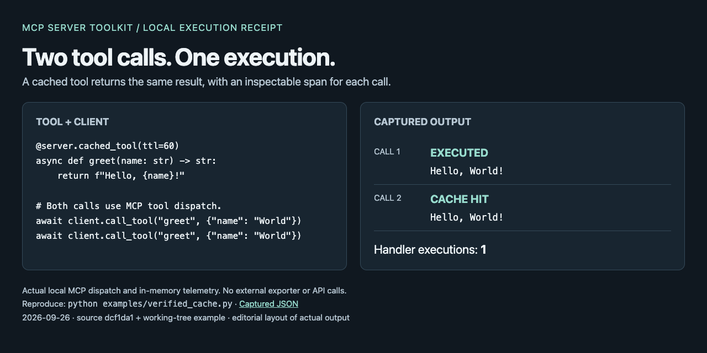
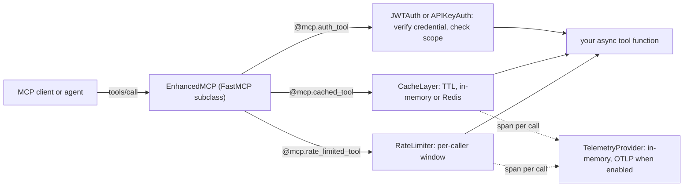

# MCP Server Toolkit: auth, caching and telemetry for Python MCP tools

[](https://github.com/ChunkyTortoise/mcp-server-toolkit/actions/workflows/ci.yml)
[](pyproject.toml)
[](LICENSE)

Every MCP server that touches real data needs the same guard code around each tool: verify the caller's token, check its scope, refuse writes to the database, cache repeat calls and trace what ran. This Python library puts that code in decorators on top of FastMCP, with JWT/JWKS auth, a sqlglot read-only SQL allowlist, a TTL cache and OpenTelemetry spans, so a tool stays a plain async function. Each guard is opt-in per tool.

```python
import asyncio, jwt
from mcp_toolkit import EnhancedMCP, JWTAuth, MCPTestClient

SECRET = "replace-with-a-32-byte-or-longer-secret"
auth = JWTAuth(secret=SECRET)  # or JWTAuth(jwks_uri=..., audience=..., issuer=...) for RS256
mcp = EnhancedMCP("orders")

@mcp.auth_tool(auth, required_scope="orders:read")
async def get_order(order_id: str, token: str = "") -> str:
    return f"order {order_id}: shipped"

async def main():
    client = MCPTestClient(mcp)  # in-process MCP dispatch, no transport
    token = jwt.encode({"sub": "agent-1", "scope": "orders:read"}, SECRET, algorithm="HS256")
    print(await client.call_tool("get_order", {"order_id": "42", "token": token}))
    print(await client.call_tool("get_order", {"order_id": "42", "token": "forged"}))

asyncio.run(main())
```

The first call prints `order 42: shipped`. The forged token prints `Error: Unauthorized — Malformed token` and the tool body never runs. Each auth decision is also written as a JSON audit-log line. To serve the same tool to Claude Desktop or any MCP client, call `mcp.run()` instead of using `MCPTestClient`.

<p align="center">
  
</p>

## Results

| Kind | Result | Value | Source |
|---|---|---|---|
| Measured | In-memory cache latency on `cached_tool`, hit vs miss (in-process mock tool, run dated 2026-04-25) | **P50 0.007 ms** hit vs **0.023 ms** miss (**3.1x**) | [`benchmarks/RESULTS.md`](benchmarks/RESULTS.md) · reproduce with [`bench_cache.py`](benchmarks/bench_cache.py) |
| CI gate | Test coverage floor: the CI test step fails below it | **80%** | [`ci.yml`](.github/workflows/ci.yml) (`--cov-fail-under=80`) |
| Inventory | Collected tests (`pytest --collect-only -q`, run 2026-10-03) | **609** | [`tests/`](tests/) |
| Inventory | Adversarial corpus: prompt injection, token forgery, scope escalation, cache poisoning, data exfiltration | **30 cases** | [`tests/adversarial/injection_corpus.jsonl`](tests/adversarial/injection_corpus.jsonl) |
| Inventory | Pre-built MCP servers | **9** | [`mcp_toolkit/servers/`](mcp_toolkit/servers/) · `[project.scripts]` in [`pyproject.toml`](pyproject.toml) |

This table is the one place each number is stated. The scope of each one is in [Methodology & limits](#methodology--limits).

## Quickstart

> Install from source. The PyPI package is an early 0.1.0 preview and doesn't include this code.

**1. Install from source.**

```bash
git clone https://github.com/ChunkyTortoise/mcp-server-toolkit.git
cd mcp-server-toolkit
pip install -e ".[dev]"
```

<details>
<summary>Install only the extras you need</summary>

```bash
pip install -e "."                 # core framework
pip install -e ".[database]"       # + PostgreSQL/pgvector (sqlglot, sqlalchemy, asyncpg)
pip install -e ".[web]"            # + web scraping (beautifulsoup4, lxml)
pip install -e ".[files]"          # + file processing (pypdf, openpyxl, python-magic)
pip install -e ".[redis]"          # + Redis-backed caching
pip install -e ".[auth]"           # + JWT/OAuth 2.1 (PyJWT[cryptography])
pip install -e ".[telemetry]"      # + OpenTelemetry + OTLP exporter
pip install -e ".[gmail]"          # + Gmail client
pip install -e ".[gcal]"           # + Google Calendar client
pip install -e ".[all]"            # database, web, files, redis, auth, telemetry
pip install -e ".[dev]"            # all of the above + tests and lint tooling
```

The example at the top of this page needs only `".[auth]"`.

</details>

**2. Run the cache demo (no API key, no network).**

```bash
python examples/verified_cache.py
```

Expected: two `Hello, World!` results, `tool_executions: 1`, then `cache_hit: false` and `cache_hit: true` in the recorded telemetry. The tool is dispatched through the MCP SDK in-process. The receipt below is a layout of one captured run ([captured JSON](docs/assets/cache-run.json), [provenance](docs/VERIFIED_DEMO.md)).

<p align="center">
  
</p>

**3. Wire servers into Claude Desktop.**

```bash
bash examples/claude_desktop_app/setup.sh
```

More runnable examples, per-server usage and the seeded RAG walkthrough are in [examples/README.md](examples/README.md).

## How it works


```mermaid
flowchart LR
  C["MCP client or agent"] -->|"tools/call"| S["EnhancedMCP (FastMCP subclass)"]
  S -->|"@mcp.auth_tool"| A["JWTAuth or APIKeyAuth: verify credential, check scope"]
  S -->|"@mcp.cached_tool"| K["CacheLayer: TTL, in-memory or Redis"]
  S -->|"@mcp.rate_limited_tool"| R["RateLimiter: per-caller window"]
  A --> F["your async tool function"]
  K --> F
  R --> F
  K -.->|"span per call"| T["TelemetryProvider: in-memory, OTLP when enabled"]
  R -.->|"span per call"| T
```

Each decorator registers the function as an MCP tool and runs its check before your code. The example at the top of this page uses `auth_tool`.

- **Auth:** `JWTAuth` verifies HS256 tokens with a shared secret, or RS256 tokens against a JWKS endpoint with key caching and rotation through PyJWT, and checks `aud` and `iss` when configured. `requires_scope` and `auth_tool` refuse the call before the tool body runs. `APIKeyAuth` stores SHA-256 hashes of keys. Code: [`auth.py`](mcp_toolkit/framework/auth.py); design: [ADR-0006](docs/adr/ADR-0006-oauth-2.1-resource-server.md).
- **Read-only SQL:** the database server's `PostgresClient` parses each query with sqlglot and accepts only an allowlist: `SELECT`, set operations, `VALUES` and `EXPLAIN` without `ANALYZE`. It rejects DML/DDL anywhere in the tree (including inside a CTE), `SELECT ... INTO`, `COPY`, statements sqlglot can't parse (`SET ROLE`, `VACUUM`), row locks, and side-effecting functions such as `pg_read_file`, `pg_terminate_backend`, `dblink` and `set_config` ([`postgres_client.py`](mcp_toolkit/servers/database_query/postgres_client.py)). Pair it with a read-only Postgres role.
- **Caching and rate limits:** `cached_tool` keys on the tool name and arguments with a TTL; `RedisCache` raises on connection errors unless you pass `fallback_to_memory=True` ([`caching.py`](mcp_toolkit/framework/caching.py), [ADR-0002](docs/adr/ADR-0002-caching-tier-strategy.md)). `rate_limited_tool` keeps a sliding window per `caller_id`, `client_id` or `user_id` ([`rate_limiter.py`](mcp_toolkit/framework/rate_limiter.py), [ADR-0005](docs/adr/ADR-0005-rate-limit-distribution.md)).
- **Telemetry and cost:** `TelemetryProvider` records a span for each cached or rate-limited call and exports real OpenTelemetry spans over OTLP when started with `initialize(use_otel=True)` ([`telemetry.py`](mcp_toolkit/framework/telemetry.py)). `CostTracker` turns provider usage objects into USD from a dated price table ([`costing.py`](mcp_toolkit/framework/costing.py), [`pricing/2026.json`](mcp_toolkit/pricing/2026.json)).
- **Testing, servers and A2A:** `MCPTestClient` calls tools in-process for unit tests ([`testing.py`](mcp_toolkit/framework/testing.py)). The pre-built servers counted in [Results](#results) cover database, web scraping, files, analytics, email, calendar, GoHighLevel CRM, Gemini embedding and multi-LLM routing ([`mcp_toolkit/servers/`](mcp_toolkit/servers/)). `A2AAdapter` exposes any server as an Agent-to-Agent agent with SSE streaming and webhooks ([`a2a_adapter.py`](mcp_toolkit/framework/a2a_adapter.py), [ADR-0007](docs/adr/ADR-0007-mcp-a2a-boundary.md)).

Usage snippets for each server and framework feature: [examples/README.md](examples/README.md).

## How it's evaluated

| Signal | What runs | When |
|---|---|---|
| **Unit and gate tests** | `pytest tests/` with the coverage floor from [Results](#results), on every Python version in the [CI matrix](.github/workflows/ci.yml) | Every push and every PR to `main` |
| **Security gate** | Forged signatures, expired tokens, wrong algorithm, missing token, insufficient scope, and a check that the tool body never runs on bad auth ([`test_gate_security.py`](tests/gates/test_gate_security.py)) | Part of the test suite |
| **Five gates** | Schema, security, semantic, scale and safety suites ([`tests/gates/`](tests/gates/)) | Part of the test suite |
| **Adversarial corpus** | Structure checks on the corpus ([`test_corpus.py`](tests/adversarial/test_corpus.py)); blocking behavior in [`test_gate_safety.py`](tests/gates/test_gate_safety.py) | Part of the test suite |
| **Lint and types** | `ruff check mcp_toolkit tests` with a pinned rule set, then `pyright` on `mcp_toolkit` | Every CI run; a weekly [lint canary](.github/workflows/lint-canary.yml) tries the newest ruff without blocking |
| **Routing evals** | `python evals/run_evals.py`: deterministic multi-LLM routing checks, no API key | Every CI run |
| **Wheel check** | Builds the wheel and sdist, installs the wheel into a clean venv, imports `EnhancedMCP` | Every CI run |
| **Quality evals** | `python evals/quality/runner.py` (deterministic); `--judge` adds LLM-as-judge scoring | [Nightly workflow](.github/workflows/evals-nightly.yml) |

Run the same checks locally:

```bash
pip install -e ".[dev]" pyright
ruff check mcp_toolkit tests
pyright mcp_toolkit
pytest tests/ -q --cov=mcp_toolkit   # CI also enforces the coverage floor in Results
python evals/run_evals.py

# Postgres integration tests (need a real database)
INTEGRATION=1 DATABASE_URL=postgres://... pytest tests/test_database_query/test_postgres_client.py
```

## Design decisions

| ADR | Decision |
|---|---|
| [ADR-0001](docs/adr/ADR-0001-enhancedmcp-extends-fastmcp.md) | `EnhancedMCP` extends FastMCP instead of wrapping it |
| [ADR-0002](docs/adr/ADR-0002-caching-tier-strategy.md) | Caching tiers: in-memory first, Redis opt-in |
| [ADR-0003](docs/adr/ADR-0003-circuit-breaker-design.md) | Circuit breakers for the multi-LLM router |
| [ADR-0004](docs/adr/ADR-0004-a2a-adapter-design.md) | A2A adapter design |
| [ADR-0005](docs/adr/ADR-0005-rate-limit-distribution.md) | Rate-limit distribution and caller-ID resolution |
| [ADR-0006](docs/adr/ADR-0006-oauth-2.1-resource-server.md) | OAuth 2.1 resource server: JWT, JWKS, scopes |
| [ADR-0007](docs/adr/ADR-0007-mcp-a2a-boundary.md) | Boundary between MCP and A2A |

## Methodology & limits

<details>
<summary>What each number covers, and what is not established</summary>

**Results table**
- The cache latency row is a historical measurement that keeps its original date and method; it is not a fresh measurement of this tree. It times a mock tool that only awaits `asyncio.sleep(0)`, so it measures cache overhead, not tool work, on a single machine. Platform, iteration and warm-up details are in [`benchmarks/RESULTS.md`](benchmarks/RESULTS.md).
- The cache receipt demonstrates behavior, not a latency benchmark. Its duration values are from one run ([captured JSON](docs/assets/cache-run.json)). The demo does not exercise network transport, external OTLP export, authentication, remote services or paid model calls ([provenance](docs/VERIFIED_DEMO.md)). The receipt PNG is an editorial layout of actual results, not an application screenshot.
- The collected-test count was taken on the date shown with the `[dev]` extras installed. It includes Postgres integration tests that skip unless `INTEGRATION=1` and `DATABASE_URL` are set. The count changes as tests are added; earlier docs stated an older figure.
- The coverage row is the CI floor, not a measured coverage figure; each CI run prints the measured value. `make test` and [CONTRIBUTING.md](CONTRIBUTING.md) use a stricter floor than CI, which the suite does not currently meet, so `make test` fails on coverage while CI passes.
- The adversarial corpus is a specification. [`test_corpus.py`](tests/adversarial/test_corpus.py) checks its structure; blocking behavior is tested separately in [`test_gate_safety.py`](tests/gates/test_gate_safety.py). Not every case is expected to be blocked at the toolkit layer: each case's `expected_blocked` field records whether it is, and the rest need a defence in your application.

**Scope of the library**
- This is a Python library. There is no hosted service or dashboard.
- There is no tagged GitHub release for the version in `pyproject.toml`; the supported install is a checkout of `main`.
- The architecture image is illustrative, not a captured trace.
- Spans are recorded automatically only by `cached_tool` and `rate_limited_tool`. A plain `@mcp.tool()` or `@mcp.auth_tool` call is not instrumented unless you call `telemetry.span()` yourself. Spans stay in memory unless you call `initialize(use_otel=True)` with an OTLP endpoint configured; external OTLP export has not been verified against a hosted backend. The span attribute for cache hits is `cache_hit`; a `cost_usd` attribute appears only when you record cost on the span.
- `rate_limited_tool` falls back to one shared `"default"` bucket, with a warning log, when the call carries no `caller_id`, `client_id` or `user_id`. The limiter is in-process, so separate server processes keep separate counters. [ADR-0005](docs/adr/ADR-0005-rate-limit-distribution.md) describes an opt-in Redis backend for the limiter; it is not implemented in [`rate_limiter.py`](mcp_toolkit/framework/rate_limiter.py) yet.
- Redis cache fallback is opt-in, not silent: `fallback_to_memory=False` is the default and a typed `_REDIS_TRANSIENT` exception signals a recoverable failure.
- The full sqlglot allowlist runs in `PostgresClient` (`read_only=True` by default). The database server itself only checks that each generated statement starts with `SELECT` or `WITH` after sqlglot parsing ([`sql_generator.py`](mcp_toolkit/servers/database_query/sql_generator.py)), so a `db_connection` you supply yourself gets only that prefix check. Neither is a framework-wide guard for other tools.
- The SQL allowlist is defense in depth, not a security boundary. A function list can't be complete, so connect with a read-only Postgres role as well (for example `default_transaction_read_only = on`, or a role with only `SELECT` grants).
- `auth_tool` and `requires_scope` read the token from a tool argument, so the token passes through the model's context. That suits local and stdio servers. For a hosted server, authenticate at the HTTP transport as the MCP authorization spec describes, and keep tokens out of tool arguments.
- `OAuthAuth` is a deprecated test-only stub; use `JWTAuth`.
- Several pre-built servers default to mock clients so they run without credentials: `crm_ghl` uses `MockGHLClient` and `gemini_embedding` uses a deterministic `MockEmbeddingClient`. The `multi_llm` router skips any provider whose API key is not set.

**Evals and demos**
- The nightly LLM-as-judge run needs an `ANTHROPIC_API_KEY` repository secret; without it the runner mocks the judge.
- The seeded RAG walkthrough ([examples/README.md](examples/README.md#seeded-rag-walkthrough)) uses deterministic demo vectors, fixed ranked sources and a template answer. It is a standalone pipeline example, not MCP tool dispatch, and not a verified semantic-search integration. Its HTML preview is an illustration that does not run Python, retrieve documents or call a model.
- The Jaeger trace screenshot comes from real `TelemetryProvider` spans emitted by a seeding script; the Jaeger-style HTML preview is a static local artifact, not a hosted dashboard. The observability Render blueprint is committed but not deployed.
- This README does not cite the latency and cost figures in [`docs/CASE_STUDY.md`](docs/CASE_STUDY.md) as results. Earlier README text described them as seeded, and no run artifact for that load test is committed.

</details>

## Roadmap

There are no open issues; these are the next steps documented in the repository.

- Ship the opt-in Redis backend for the rate limiter described in [ADR-0005](docs/adr/ADR-0005-rate-limit-distribution.md).
- Deploy the observability stack from its committed [Render blueprint](examples/observability/render.yaml) and verify OTLP export end to end.
- Commit a run artifact for the [case study](docs/CASE_STUDY.md) load test, or replace its figures with a reproducible run.

## Contributing

See [CONTRIBUTING.md](CONTRIBUTING.md) for setup, test commands, how to add a new server, and the PR process.

## License

MIT
