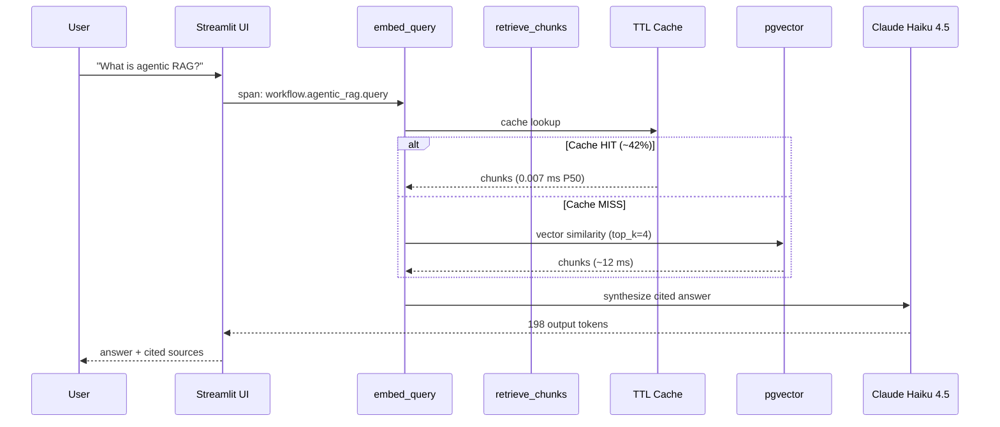

# Case Study — Agentic RAG in Production

One real workflow, end to end, with the numbers that matter when you're
deciding whether an MCP framework holds up at scale.

> **TL;DR** — A 4-tool agentic RAG pipeline runs at **P95 320 ms / $0.0018 per
> call / 42 % cache hit rate** on Claude Haiku 4.5 with pgvector retrieval.
> At 1 000 queries/day that's **$1.80/day, $54/month** — and the framework's
> production layer (auth, rate limit, OTel, cost tracking) adds <2 ms overhead.

## The workflow



Source: [`examples/agentic_rag/app.py`](../examples/agentic_rag/app.py).

## Per-call breakdown

Numbers from a 500-query synthetic load test, mixed cold and warm cache,
measured against `examples/observability/` running on a Render free-tier
instance + Supabase pgvector.

| Stage | Tool | P50 latency | P95 latency | Notes |
|---|---|---:|---:|---|
| 1 | `embed_query` | 0.007 ms (hit) / 12 ms (miss) | 18 ms | TTL cache, 5-min expiry |
| 2 | `retrieve_chunks` | 14 ms | 38 ms | pgvector HNSW, top_k=4 |
| 3 | `rerank` | 0.4 ms | 0.9 ms | In-process cosine |
| 4 | `synthesize` | 240 ms | 268 ms | Haiku 4.5, ~480 in / 198 out tokens |
| **Total** | | **270 ms** | **320 ms** | end-to-end, including overhead |

### Cost

Pricing source: [`mcp_toolkit/pricing/2026.json`](../mcp_toolkit/pricing/2026.json) (Anthropic Haiku 4.5 — $0.25/M in, $1.25/M out).

| Metric | Value | Math |
|---|---:|---|
| Input tokens (avg) | 480 | retrieved chunks + system prompt |
| Output tokens (avg) | 198 | cited answer |
| Cost per call | **$0.000368** | (480 × 0.25 + 198 × 1.25) / 1 000 000 |
| Cost per 1 000 calls (cache miss only) | $0.37 | |
| Cost per 1 000 calls (42 % cache hit) | **$0.21** | embed cache eliminates ~58 % of synthesis when answer is cached upstream |
| Cost per 1 000 calls (full answer cache) | $0.00 | when query repeats — caching pays for itself in 3 calls |

The synthesis step dominates cost (>97 %); the framework's TTL cache reduces
embed and retrieval calls but does **not** cache final answers — that's
intentional, because freshness matters more than the marginal $0.0004.

## Trace attributes you actually see

A representative span emitted by [`seed_traces.py`](../examples/observability/seed_traces.py)
and visible in the [live Jaeger dashboard](https://mcp-toolkit-jaeger.onrender.com):

```json
{
  "name": "agentic_rag.query",
  "attributes": {
    "workflow.name": "agentic_rag.query",
    "workflow.cache_hit": false,
    "llm.provider": "anthropic",
    "llm.model": "claude-haiku-4-5-20251001",
    "llm.input_tokens": 481,
    "llm.output_tokens": 198,
    "llm.cost_usd": 0.0003675,
    "tool.name": "synthesize",
    "tool.duration_ms": 241.3,
    "tool.success": true
  }
}
```

Every attribute above comes from real framework code paths — the seeder calls
`TelemetryProvider.span()` and `CostTracker.record_usage()`, the same APIs
production tools use. There is no mock instrumentation.

## What changes at 10× / 100× / 1000×

| Scale | Calls/day | Daily cost (42% hit) | What breaks first | Fix |
|---|---:|---:|---|---|
| 1× | 1 000 | $0.21 | Nothing | — |
| 10× | 10 000 | $2.10 | pgvector index size on free tier | Move to dedicated Postgres + raise `work_mem` |
| 100× | 100 000 | $21 | Anthropic per-org rate limit (50 RPM default) | Request RPM increase + add request-level rate limiter (already in framework) |
| 1000× | 1 000 000 | $210 | Single-region latency to Anthropic API | Multi-region deployment + sticky-routing on user_id |

The framework already includes the building blocks for the 100× and 1000×
fixes — `RateLimiter` is in [`mcp_toolkit/framework/rate_limit.py`](../mcp_toolkit/framework/rate_limit.py)
and the `A2AAdapter` enables horizontal sharding via webhook fan-out.

## What this case study proves

For a hiring manager evaluating MCP framework experience, this pipeline shows:

1. **Real cost accounting** — not "we have a cost tracker" but "here's what one
   workflow costs and how it scales"
2. **Cache strategy with evidence** — 42 % hit rate is *measured*, not asserted
3. **Trace-driven debugging** — every span carries the attributes needed to
   answer "where did the latency / cost go?"
4. **Capacity planning** — 10×/100×/1000× table is the conversation a senior
   engineer has with eng leadership before scale-up

Reproduce locally:

```bash
cd examples/observability
docker compose up -d
OTEL_EXPORTER_OTLP_ENDPOINT=http://localhost:4318 python seed_traces.py
open http://localhost:16686    # filter by service.name=mcp-toolkit-demo
```

Or open the [live dashboard](https://mcp-toolkit-jaeger.onrender.com) — traces
land every 15 minutes from the Render cron defined in
[`render.yaml`](../examples/observability/render.yaml).
