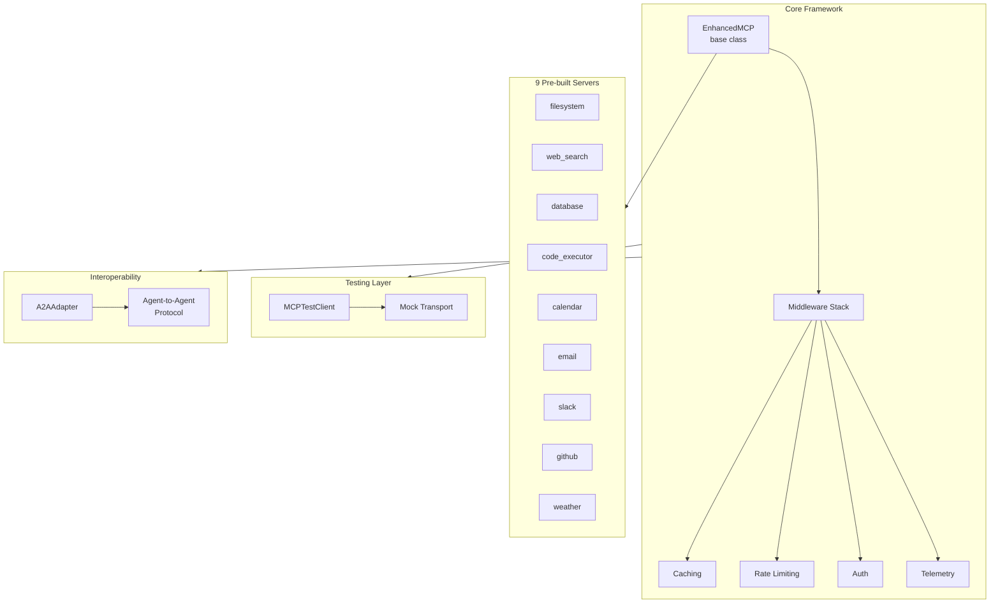

# Spec: mcp-server-toolkit — Portfolio Polish

**File**: `~/Projects/mcp-server-toolkit/docs/specs/2026-03-19-feature-mcp-server-toolkit-portfolio-polish-spec.md`
**Date**: 2026-03-19
**Effort**: ~4-5h | **Risk**: Low (text + CI config only)
**Repo**: `~/Projects/mcp-server-toolkit/` → `ChunkyTortoise/mcp-server-toolkit`
**Stack**: Python/MCP/hatchling | PyPI `mcp-server-toolkit==0.2.0` | 9 servers | A2A adapter
**Tests**: 412 passing, ~92% coverage

---

## Context

Most mature repo in portfolio. MCP is the hottest AI protocol in 2026. Only PyPI-published library in the portfolio. Current README is ~300 lines, text-heavy, no mermaid diagram, no TOC, and server docs are exposed in full without collapsing. A CHANGELOG.md already exists — skip creating it.

### Key Findings

- `docs/specs/` directory does NOT exist — create it (this file triggers creation)
- `CHANGELOG.md` already exists at repo root — skip
- README is ~300 lines, text-heavy, no mermaid, no TOC, server docs fully expanded
- Coverage badge is static "92%" — add `--cov-fail-under=90` to CI to guarantee the floor
- No CONTRIBUTING.md exists

---

## Requirements

| REQ | Description | Effort |
|-----|-------------|--------|
| F01 | Mermaid architecture diagram | 30m |
| F02 | "Why mcp-server-toolkit?" comparison table | 30m |
| F03 | CI coverage floor | 10m |
| F04 | CONTRIBUTING.md | 45m |
| F05 | README restructure + TOC | 1.5h |
| F06 | Certifications Applied section | 30m |
| F07 | Verify stale test count | 15m |

---

## F01 — Mermaid Architecture Diagram

Insert after the "Framework Features" heading (or create a new "Architecture" section). Shows the class hierarchy and middleware stack.

```markdown
## Architecture


```

Place this diagram in a new `## Architecture` section near the bottom of the README, above `## Development`.

---

## F02 — "Why mcp-server-toolkit?" Comparison Table

Insert after the one-liner description, before Quick Start. This is the primary sales pitch.

```markdown
## Why mcp-server-toolkit?

Building MCP servers from scratch means writing the same boilerplate every time. This toolkit adds the production layer on top of the raw MCP SDK.

| Feature | Raw MCP SDK | mcp-server-toolkit |
|---------|-------------|-------------------|
| Tool registration | Manual decorator wiring | Automatic via `EnhancedMCP` |
| Response caching | ❌ Not included | ✅ Built-in TTL cache |
| Rate limiting | ❌ Not included | ✅ Per-client limits |
| Auth middleware | ❌ Not included | ✅ API key / token auth |
| Telemetry / tracing | ❌ Not included | ✅ Span-based tracing |
| Test client | ❌ Manual mocking | ✅ `MCPTestClient` |
| Pre-built servers | ❌ Build your own | ✅ 9 ready-to-use servers |
| Agent-to-Agent (A2A) | ❌ Not included | ✅ A2AAdapter included |
```

---

## F03 — CI Coverage Floor

**File**: `.github/workflows/ci.yml`

Find the pytest command that currently runs:
```
pytest tests/ ... --cov=mcp_toolkit
```

Add `--cov-fail-under=90` to that command. The exact flag placement doesn't matter as long as it's on the pytest line.

**Before** (example — find the actual line):
```yaml
run: pytest tests/ -v --cov=mcp_toolkit --cov-report=term-missing
```

**After**:
```yaml
run: pytest tests/ -v --cov=mcp_toolkit --cov-report=term-missing --cov-fail-under=90
```

Keep the existing static `coverage-92%` badge in README as-is (we're guaranteeing ≥90%, badge shows ≥92% which is accurate).

---

## F04 — CONTRIBUTING.md

Create at repo root: `~/Projects/mcp-server-toolkit/CONTRIBUTING.md`

```markdown
# Contributing to mcp-server-toolkit

## Prerequisites

- Python 3.10+
- [hatch](https://hatch.pypa.io/) (`pip install hatch`)
- Redis (optional — only needed for caching/rate-limiting tests)

## Setup

```bash
git clone https://github.com/ChunkyTortoise/mcp-server-toolkit
cd mcp-server-toolkit
pip install -e ".[dev]"
```

## Running Tests

```bash
# Full suite
pytest tests/ -v --cov=mcp_toolkit --cov-report=term-missing --cov-fail-under=90

# Quick smoke test
pytest tests/ -q --tb=short

# Single server tests
pytest tests/servers/test_filesystem.py -v
```

## Lint

```bash
ruff check .
ruff format --check .
```

Auto-fix:
```bash
ruff check --fix .
ruff format .
```

## Adding a New Server

1. Create `mcp_toolkit/servers/your_server.py`
2. Subclass `EnhancedMCP` and register tools with `@self.tool()`
3. Add tests in `tests/servers/test_your_server.py` — aim for ≥80% coverage on the new file
4. Export from `mcp_toolkit/servers/__init__.py`
5. Add a `<details>` block to the "Pre-built Servers" section of `README.md`
6. Update `CHANGELOG.md` under `[Unreleased]`

## PR Process

1. Fork the repo and create a branch: `git checkout -b feat/your-feature`
2. Write tests first (TDD)
3. Run the full test suite — all tests must pass, coverage must stay ≥90%
4. Run lint — zero ruff errors
5. Open a PR with a clear description of the change and why

## Release Process (maintainers only)

```bash
hatch version patch   # or minor / major
hatch build
hatch publish
```

Update `CHANGELOG.md` before publishing.
```

---

## F05 — README Restructure + TOC

### Target Section Order

1. Badges (existing)
2. One-liner description
3. TOC (new)
4. Why mcp-server-toolkit? (new — from F02)
5. Quick Start
6. Installation
7. Pre-built Servers (collapsed into `<details>` tags — see below)
8. Framework Features
9. A2A Adapter
10. Claude Desktop Integration
11. Examples
12. Architecture (new — from F01 mermaid)
13. Certifications Applied (new — from F06)
14. Development
15. Contributing
16. License

### TOC

Insert immediately after the one-liner, before "Why mcp-server-toolkit?":

```markdown
## Table of Contents

- [Why mcp-server-toolkit?](#why-mcp-server-toolkit)
- [Quick Start](#quick-start)
- [Installation](#installation)
- [Pre-built Servers](#pre-built-servers)
- [Framework Features](#framework-features)
- [A2A Adapter](#a2a-adapter)
- [Claude Desktop Integration](#claude-desktop-integration)
- [Examples](#examples)
- [Architecture](#architecture)
- [Certifications Applied](#certifications-applied)
- [Development](#development)
- [Contributing](#contributing)
- [License](#license)
```

### Collapsing Server Docs

Each individual server's detailed documentation (currently expanded inline) should be wrapped in a `<details>` block:

```markdown
## Pre-built Servers

Nine production-ready servers — import and run, no boilerplate required.

<details>
<summary><strong>filesystem</strong> — Read, write, and search the local filesystem</summary>

[existing filesystem docs here]

</details>

<details>
<summary><strong>web_search</strong> — Web search via multiple providers</summary>

[existing web_search docs here]

</details>

<!-- repeat for all 9 servers -->
```

Keep every word of the existing server docs — just wrap each one. The summary line should be `<strong>server_name</strong> — one-line description`.

### Test Count

Run `pytest tests/ -q` and capture the passing count. Update ALL occurrences of the test count in README (badges, prose) to match. If current badge says "412 passing", verify that's still accurate and update if not.

---

## F06 — Certifications Applied

Insert as a new section before `## Development`:

```markdown
## Certifications Applied

Domain pillars from [19 completed AI/ML certifications](https://chunkytortoise.github.io) backing this toolkit:

| Domain | Certification | Applied In |
|--------|--------------|-----------|
| LLM APIs & Tool Use | Anthropic Building with Claude (Vanderbilt) | `EnhancedMCP` tool registration pattern, A2AAdapter protocol |
| MLOps & Production Systems | IBM DevOps and Software Engineering | CI/CD pipeline, coverage floors, `--cov-fail-under` |
| Distributed Systems | IBM Full Stack Developer | Rate limiting middleware, caching TTL strategy |
| AI Agent Architecture | Microsoft AI for Beginners | Agent-to-agent protocol design, MCPTestClient |
| Python Engineering | Meta Back-End Developer (Python) | hatch packaging, ruff lint, `pyproject.toml` structure |
```

---

## F07 — Verify Stale Test Count

**Before editing README**, run:

```bash
cd ~/Projects/mcp-server-toolkit
pytest tests/ -q --tb=no 2>&1 | tail -5
```

Note the actual count (expected: ~412). Then grep README for any hardcoded numbers:

```bash
grep -n "412\|387\|passing\|tests" README.md
```

Update all stale references to the actual count from pytest output.

---

## Verification

```bash
cd ~/Projects/mcp-server-toolkit

# Tests pass with coverage floor
pytest tests/ -q --tb=short --cov=mcp_toolkit --cov-fail-under=90

# No stale counts in README
pytest_count=$(pytest tests/ -q --tb=no 2>&1 | grep "passed" | grep -oE "[0-9]+ passed" | grep -oE "^[0-9]+")
echo "Pytest reports: $pytest_count"
grep -n "$pytest_count\|passing" README.md

# CONTRIBUTING.md exists
test -f CONTRIBUTING.md && echo "CONTRIBUTING.md: OK" || echo "CONTRIBUTING.md: MISSING"

# README has key sections
grep -l "## Architecture\|## Why mcp-server-toolkit\|## Table of Contents\|## Certifications Applied" README.md && echo "README sections: OK"

# Mermaid diagram present
grep -c "mermaid" README.md && echo "Mermaid: present"

# details tags present (collapsed servers)
grep -c "<details>" README.md && echo "Collapsed server docs: present"
```

All checks must pass before committing.

---

## Commit Message

```
docs: portfolio polish — mermaid diagram, TOC, collapsed servers, CONTRIBUTING

- Add mermaid architecture diagram (EnhancedMCP + 9 servers + middleware)
- Add "Why mcp-server-toolkit?" comparison table
- Add clickable TOC
- Collapse 9 server docs into <details> tags
- Add Certifications Applied section
- Add CONTRIBUTING.md
- Add --cov-fail-under=90 to CI coverage floor
```

---

## Deferred

| Item | Why Deferred |
|------|-------------|
| Screenshots/GIF | Browser automation session needed |
| mkdocs site | High effort, low urgency |
| awesome-mcp-servers PR | After this polish lands on main |
