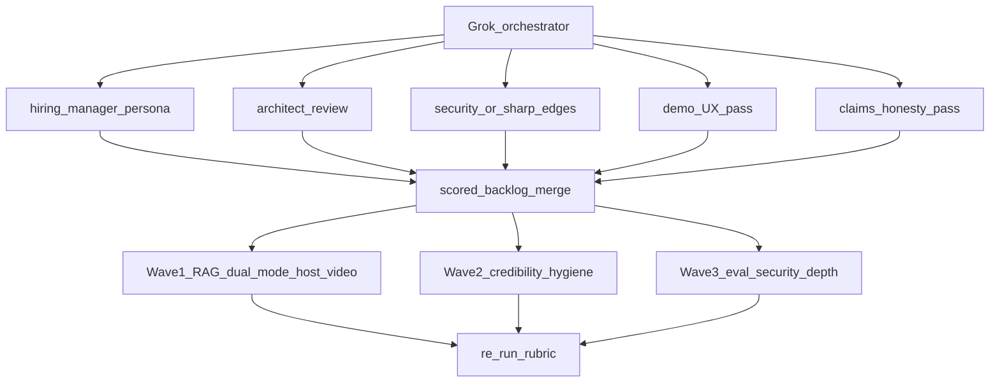

# MCP Server Toolkit Hireability Overhaul — Design

**Date:** 2026-07-19  
**Status:** Approved for implementation  
**Repo:** `clients/mcp-server-toolkit`  
**Lane:** Full-stack AI eng (stranger-reachable demos, polished README story)

## Problem

`mcp-server-toolkit` is a locked portfolio hero (Library / MCP lane) with real depth — framework, 9 servers, gates, adversarial corpus, eval CI, measured benchmarks. Prior hireability waves closed many gaps, but a hiring manager optimizing for **full-stack AI eng** still hits:

1. No stranger-reachable interactive demo (agentic RAG needs clone + optional keys; observability Render blueprint undeployed).
2. Claims risk — README documents a substrate auditor as CI evidence while related files were local WIP; test-count / coverage-floor drift; PyPI `0.1.0` vs tree `0.3.0`.
3. Demo narrative still centers infra (Jaeger) more than an interactive agentic product surface.

Global portfolio pin order remains `docextract → recovergate → EnterpriseHub → mcp-server-toolkit`. This design is a **parallel polish pass** on mcp, not a reorder of heroes.

## Goals

- Stranger opens a **hosted agentic RAG URL in &lt;60s** without bringing API keys (deterministic demo mode).
- Short **walkthrough video/GIF** pinned above the fold alongside the live URL.
- Parallel **specialist agent audit** produces a fresh scored backlog; remediate **P0 + top P1** only.
- Re-score to hero-audit style **~42/50+** with the Demo dimension clearly up.
- CI green; README claims match measured reality; no false PyPI currency claims.

## Non-goals

- Making mcp the #1 hero ahead of docextract evalgate.
- Full platform rewrite, new pre-built MCP servers, or satellite-repo absorbs.
- Live Jaeger as the primary showcase (observability stays secondary).
- Publishing PyPI `0.3.0` without an explicit owner-gated publish play (default: source-install-first honesty).

## Decisions locked

| Decision | Choice |
|---|---|
| Hiring lane | Full-stack AI eng |
| Depth | Parallel specialist agent audit → ranked P0/P1 remediation |
| Hero surface | Agentic RAG (`examples/agentic_rag/`) |
| Reachability | Hosted public URL + short walkthrough video/GIF |
| Demo authenticity | Dual mode — deterministic default; optional live LLM when server key present |

## Architecture

**Orchestrator:** Grok conducts. Composer 2.5 workers handle bounded implementation. Judgment agents: hiring-manager persona, architect review, security/sharp-edges, plus demo-UX and claims-honesty passes. Claude/Codex depth only via cmux panes when a pass needs it.

**Prior evidence (must not be restated blindly):**

- `~/Projects/job-search/hero-audit-enterprisehub-mcp-2026-07-09.md`
- `research/2026-04-25-gpt5-audit/REPORT.md`
- `docs/specs/codex-roi-evaluation-prompt.md`

Agents must cite **fresh** evidence (paths, CI status, measured counts) when scoring.

## Agent roster and rubrics

| Agent | Rubric focus | Kill gate (fail = hire-killer → P0) |
|---|---|---|
| Hiring-manager persona | 60s scan, README story, would-interview | No clickable demo; claims ahead of git; "production-ready" without proof |
| Architect review | Framework coherence, example quality, ADR honesty | Dead examples; incoherent extras; ADRs that don't match code |
| Security / sharp-edges | Substrate auditor, adversarial corpus, auth footguns | Auditor documented but uncommitted; gates not in CI |
| Demo UX | RAG dual-mode, hosted path, video | Demo needs visitor API keys; cold-start with no fallback story |
| Claims honesty | Test counts, coverage floors, PyPI version, badges | README ≠ measured reality |

**Merge rules:**

- Any kill-gate failure → **P0**.
- Shared medium findings dedupe into one backlog item.
- Cap remediation to **P0 + top P1s that move full-stack signal** (avoid EnterpriseHub-scale sprawl).
- Each backlog item: severity, evidence path, fix sketch, kill criteria for done.

**Scorecard artifact:** `docs/superpowers/specs/2026-07-19-mcp-hireability-scorecard.md` (written during the audit run).

## Wave 1 — Hero demo

Harden `examples/agentic_rag/` into explicit dual mode and make it stranger-reachable.

### Demo mode (default)

- Seeded in-memory corpus (already present as `_DEMO_CHUNKS`).
- Deterministic retrieve + fixture synthesize — no visitor keys.
- UI clearly labels **Demo mode**.
- Rate-limit / query caps even in demo mode to blunt abuse of a public URL.

### Live mode (optional)

- Enabled when server-side `ANTHROPIC_API_KEY` (and optionally `PGVECTOR_URL`) is present.
- Hard rate limits and abuse caps.
- Never require the *visitor* to paste keys.

### Hosting + video

- Deploy via Render (preferred; `examples/observability/render.yaml` patterns exist) or Streamlit Community Cloud if lighter.
- Seed data at boot; cold-start story: banner + link to GIF when waking.
- Record 30–60s walkthrough; pin **Live demo** URL + GIF at top of README.
- Observability remains secondary: static `assets/jaeger-trace-preview.html` + optional local Docker.

## Wave 2 — Credibility hygiene

- **Substrate auditor:** commit module + tests and wire a CI step, **or** remove README Hiring Evidence claims that imply it is shipped.
- Align test count and coverage floors (README vs CI `--cov-fail-under=80` vs Makefile local floor).
- Fix or verify `evals-nightly.yml`; add eval/coverage badges only if green.
- **PyPI:** keep source-install-first unless an owner-gated publish ships matching `0.3.0`; scrub stale "pip install ==0.3.0 works" from `.claude/CLAUDE.md` and similar.
- Scrub leftover "production-ready" from `pyproject.toml` / `mcp_toolkit/__init__.py` if present.
- Confirm `.envrc` remains gitignored (already listed).

## Wave 3 — Eval / security depth (bounded)

- Expand quality evals only where they support the RAG/demo narrative.
- If Wave 2 kept the substrate auditor, ensure it runs in CI.
- Do not absorb satellite repos or add new pre-built servers.

## Success criteria

1. Hosted RAG URL works in demo mode without visitor keys in &lt;60s.
2. Video/GIF linked above the fold in README.
3. Scorecard re-run shows kill-gates cleared; Demo dimension up; overall ~42/50+.
4. CI green on mainline matrix; README metrics match `pytest --collect-only` / measured coverage.
5. No claim of PyPI currency unless publish play ships.

## Error handling and testing

- Demo mode must never raise uncaught errors to the Streamlit UI for missing keys — fall back to fixtures and label the path.
- Live mode failures fall back to demo synthesize with an explicit notice.
- Unit tests for pipeline helpers (demo retrieve, demo synthesize, mode detection) under `tests/` (or `examples/agentic_rag/` tests if that pattern exists).
- Wave 2 changes must keep `pytest` + CI coverage gate green.
- Substrate auditor tests (if kept) use committed sample transcripts under `tests/security/samples/`.

## Out of scope (reiterated)

- Reordering the global hero pin list.
- Hosted Jaeger as the primary proof.
- Broad eval parity with docextract's 200-case evalgate.

## Handoff

Implementation plan: `docs/superpowers/plans/2026-07-19-mcp-hireability-overhaul.md`  
Execute via subagent-driven development or executing-plans after the plan is written.
